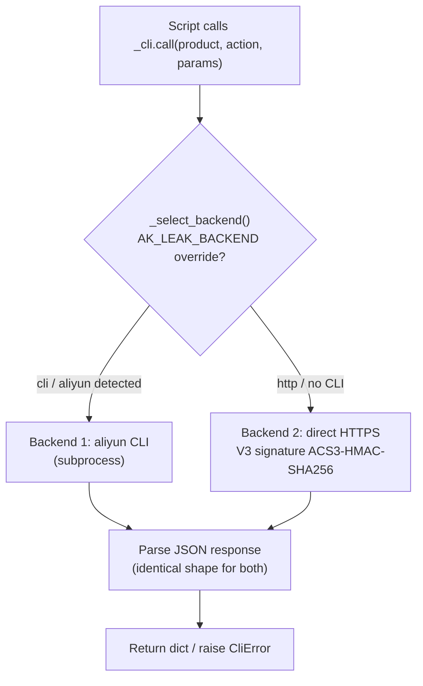
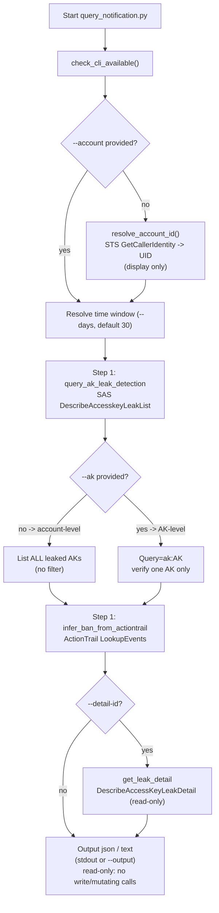
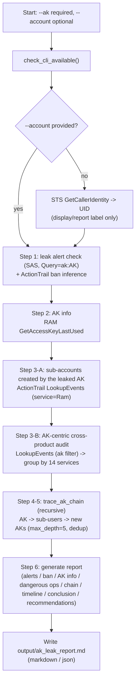

# Investigation Flow (Dual-Backend, Public API Edition)

This document captures the end-to-end runtime flow of the AK-leak incident
response skill: the shared dual-backend dispatch layer, the account-level
self-check script, and the 6-step chain-following orchestrator.

All Alibaba Cloud API calls go through a single entry point, `_cli.call()`, so
the business scripts never need to know whether the request was served by the
aliyun CLI or by the direct V3-signed HTTPS fallback.

---

## 1. Dual-Backend Dispatch Layer

Every SAS / RAM / ActionTrail / STS call funnels through `_cli.call()`.



- Backend is chosen once per process and cached.
- Credentials: CLI backend uses the aliyun profile (`~/.aliyun/config.json`);
  HTTP fallback resolves env AK/SK (+ optional security token) or config.json.
- The AccessKey Secret / security token are used only for signing and are
  never printed or logged.

---

## 2. Account-Level Leak Self-Check — `query_notification.py`

Runs with zero required input: with only a configured credential it derives the
UID and lists all leaks flagged for the account.



---

## 3. Six-Step Chain-Following Orchestrator — `ak_leak_investigation.py`

`--ak` is required (the leaked AK is the starting point); `--account` is optional
and auto-derived for report labeling only.



---

## Key Notes

- **Backend is transparent to business logic** — all calls above route through
  `_cli.call()`; scripts do not care whether CLI or HTTP served the request.
- **UID is display-only** — the auto-derived UID is used purely for report /
  log labeling; it is never passed as an API parameter (queries are scoped to
  the account bound to the credential).
- **Account-level vs AK-level** — `query_notification.py` without `--ak` is
  account-wide; the orchestrator is always AK-centric (starts from the leaked
  AK and follows the chain).
- **No write operations** — this skill is strictly read-only; it never marks
  leak-deal status, disables, modifies, or deletes any AccessKey. When a leak
  is confirmed (Security Center alert, inferred ban, or high-risk activity),
  `ak_leak_investigation.py` prints a prominent URGENT banner at the top of the
  report telling the operator to manually **disable** the leaked AK, **replace**
  it with a new one everywhere it is used, then **delete** it.
- **Sensitive-data masking** — sensitive identifiers (AccessKey ID, account
  UID) are masked in all output (console logs, markdown / text report, and JSON)
  via `_cli.mask_sensitive()`. Set `AK_LEAK_NO_MASK=1` to emit raw values.
  The AccessKey Secret and security token are never emitted in any form.
```
