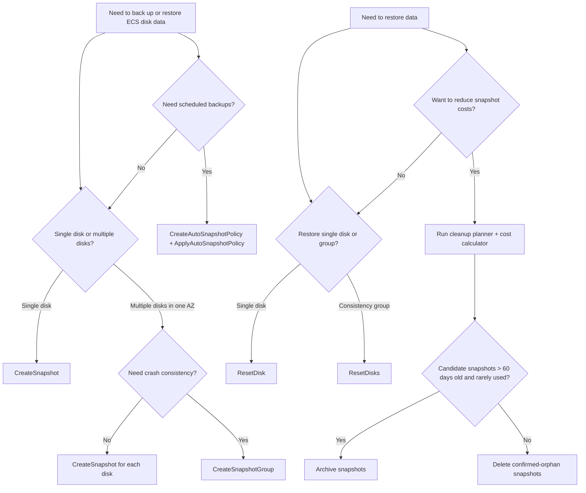

# Snapshot Workflow Decision Tree

Use this decision tree to choose the right snapshot operation for a given scenario.

## Decision tree

## Scenario mapping

| Scenario | Recommended operation | Key pre-check |
|----------|----------------------|---------------|
| Daily backup of one data disk | `CreateSnapshot` + `RetentionDays` | Disk `In_use` or `Available` |
| Weekly full backup of an entire instance | `CreateSnapshotGroup` | All disks ESSD, same AZ, instance `Running` or `Stopped` |
| Recurring nightly backups | `CreateAutoSnapshotPolicy` + `ApplyAutoSnapshotPolicy` | Policy time points spread across low-traffic hours |
| Recover from failed OS upgrade | `ResetDisk` | Instance `Stopped`; create current-state snapshot first |
| Recover a clustered database | `ResetDisks` from consistency group | All group disks intact; instance `Stopped` |
| Clean up old snapshots | `snapshot_cleanup_planner.py` | Review `Usage` field for image/disk dependencies |
| Reduce monthly snapshot bill | `snapshot_cost_calculator.py` | Classify standard vs archive; verify retention needs |

## Lifecycle workflow example

### Daily protection

1. Create or apply an auto snapshot policy:
   - `RepeatWeekdays`: `["1","2","3","4","5","6","7"]`
   - `TimePoints`: `["3"]`
   - `RetentionDays`: `7`
2. Apply the policy to production disks.
3. Weekly, run `DescribeSnapshots` to verify snapshots are created as expected.

### Upgrade protection

1. Before the upgrade, run `CreateSnapshot` (single disk) or `CreateSnapshotGroup` (whole instance).
2. Wait until `Status` is `accomplished`.
3. Perform the upgrade.
4. If the upgrade succeeds, delete the pre-upgrade snapshot after a stabilization period.
5. If the upgrade fails, create a current-state snapshot, then run `ResetDisk` or `ResetDisks`.

### Cost optimization workflow

1. Export all snapshots with `DescribeSnapshots`.
2. Run `snapshot_cost_calculator.py` to estimate current spend.
3. Run `snapshot_cleanup_planner.py` to identify deletion and archive candidates.
4. Review candidate list for `Usage` dependencies.
5. Delete confirmed-orphan snapshots.
6. Archive snapshots older than 60 days that are rarely accessed.
7. Re-run the cost calculator to estimate savings.
