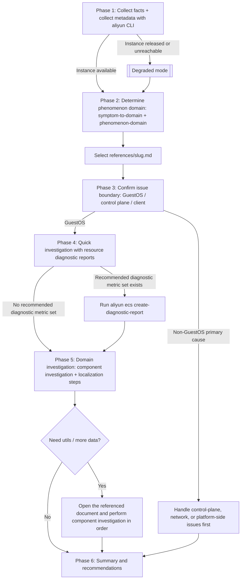

# ECS Linux Troubleshooting

This skill applies **only to Linux GuestOS on Alibaba Cloud ECS** and diagnoses abnormal issues on the Alibaba Cloud ECS Linux instance specified by the user (the target instance). The agent may run on the target instance or another machine, and uses the aliyun CLI to remotely diagnose and collect data from the target ECS instance.

## When to Use This Skill

- The troubleshooting target specified by the user is an Alibaba Cloud ECS Linux instance.
- The user's description involves abnormal issues such as mismatches between startup/running status and OS state, remote login failures, network connectivity failures, disk expansion/mount issues, performance anomalies, crashes or hangs, clock drift, or configurations not taking effect.
- **Not applicable**: non-Alibaba Cloud ECS, non-Linux GuestOS, other clouds or physical machines; purely control-plane, billing, or API-side issues with no GuestOS involvement.

## Principles and Requirements

1. **Troubleshooting target = the Alibaba Cloud ECS Linux instance specified by the user**: all checks and conclusions must target that one machine. Commands and paths in `references/` are written for the in-instance environment.
2. **Use the aliyun CLI for remote diagnosis and data collection**: except for the steps in [`references/utils/guestos-pe-prep.md`](references/utils/guestos-pe-prep.md), all other steps may only use the subcommands listed in [`references/aliyun-cli-cheatsheet.md`](references/aliyun-cli-cheatsheet.md). **Do not call subcommands that are not listed there**.
3. **Clarify the problem before investigating**: strictly follow the **troubleshooting workflow**. First narrow the user's description to a **phenomenon domain**, then follow the corresponding **troubleshooting document**. **Do not skip phases or reorder them**, and **do not draw a conclusion or stop the workflow early when the evidence does not uniquely point to a single root cause**.
4. Prefer the commands described in the `references/<slug>.md` troubleshooting document. **Do not blindly guess commands on your own**.
5. **External reference material**: when a troubleshooting document contains a URL, such as an Alibaba Cloud help page, **you must fetch the content of that link and use it as the basis for the investigation**. Do not judge based only on the link title or on prior knowledge.
6. **Multiple-instance scenarios**: troubleshoot each ECS instance separately. Do not use results from instance A to draw conclusions about instance B.
7. **Least-privilege permissions**: before running this skill, ensure the caller has only the required RAM actions for the selected workflow. Use [`references/ram-policies.md`](references/ram-policies.md) as the permission source of truth.

## Progress Checklist

Before starting the troubleshooting workflow, create the following 6 phase tasks with the progress checklist tool. After completing each phase, **immediately** mark the corresponding task as complete before moving to the next phase:

1. [ ] Phase 1: Clarify the abnormal issue
2. [ ] Phase 2: Classify into a phenomenon domain
3. [ ] Phase 3: Confirm whether it is a GuestOS issue
4. [ ] Phase 4: Diagnostic tool investigation
5. [ ] Phase 5: GuestOS-internal component investigation
6. [ ] Phase 6: Summary and recommendations

## Input Validation and Execution Safety

Validate all user-provided and model-derived values before placing them in an aliyun CLI command because invalid identifiers or shell metacharacters can target the wrong resource or change command meaning.

- Business region (`--biz-region-id`): allow only Alibaba Cloud region identifiers such as `cn-hangzhou`; use `^[a-z]+-[a-z]+-[a-z0-9]+$` as the baseline pattern.
- ECS instance IDs, disk IDs, image IDs, security group IDs, ENI IDs, diagnostic report IDs, and invoke IDs: require the expected product prefix and reject whitespace, quotes, shell metacharacters, command substitution, or newlines.
- JSON parameters such as `InstanceIds` and `AdditionalOptions`: build them with a JSON serializer or a quoted literal verified as valid JSON; do not concatenate untrusted fragments.
- Time windows: accept only ISO 8601 timestamps and ensure `StartTime <= EndTime`.
- Passwords and key-pair names in offline rollback: treat them as sensitive inputs, never echo them in the final report, and pass them only after explicit user confirmation.
- If any value cannot be validated, stop that command path and ask the user for a corrected value.

Use bounded waits for all polling operations because cloud operations may stay pending or fail silently. Default policy: poll every 10 to 20 seconds, stop after 10 minutes or 30 attempts, and then report the last observed status and the next safe action. A referenced document may define a shorter timeout for a specific operation.

## Observability

Every aliyun CLI command must include the following user-agent parameter:

```bash
--user-agent AlibabaCloud-Agent-Skills/alibabacloud-ecs-linux-os-troubleshooting/{session-id}
```

Requirements:

1. Generate or obtain one non-empty `session-id` for each troubleshooting session.
2. Reuse the same `session-id` for all aliyun CLI commands within the same troubleshooting session.
3. Do not reuse a `session-id` across different troubleshooting sessions.
4. Include the parameter in every example and every actual aliyun CLI command execution.

Example:

```bash
aliyun ecs describe-instances \
  --biz-region-id <region-id> \
  --instance-ids '["<instance-id>"]' \
  --user-agent AlibabaCloud-Agent-Skills/alibabacloud-ecs-linux-os-troubleshooting/<session-id>
```

## Troubleshooting Workflow

**Execute the phases in order.**

### Phase 1: Clarify the Abnormal Issue

First, call `DescribeInstances` to query the instance information:

- **Success**: record the instance metadata, such as region, image, and status, then continue with the normal workflow below.
- **Failure** (an error or an empty result is returned): ask the user "Has this instance been released?"
  - The user confirms it is released: enter **degraded mode**, see [`references/degraded-mode.md`](references/degraded-mode.md).
  - The user denies it but confirms the instance ID is correct: also enter **degraded mode**.

Before opening any domain document, if the user's issue description is vague, **first refine the issue through multi-turn dialogue**. Use the **aliyun CLI** and **questions to the user** to complete the evidence and related environment information for when the abnormal issue occurred. This usually includes the following information:

| Dimension | Information to Complete | How to Obtain |
| --- | --- | --- |
| **Basic instance information, status, and specification** | Instance status | Call aliyun CLI as needed |
| **Scope** | Whether it is reproducible; start and end time; whether there were changes, restarts, scale-out/scale-in, or configuration changes when the abnormal issue occurred | Ask the user |
| **Access channel** | Whether VNC is available; whether SSH/Workbench/Cloud Assistant is available | Ask the user |
| **Network direction** | External source to instance service port, instance to external network, only intra-VPC connectivity, etc. | Ask the user |
| **Symptoms** | Original error messages and screenshots | Ask the user |

Note: the instance status and the GuestOS status may be inconsistent. Even if the instance status is `Running`, the GuestOS kernel may have failed to start. This phase **only completes the environment information; do not make any root cause judgment or output any conclusion**.

### Phase 2: Classify into a Phenomenon Domain

1. Open [`references/symptom-to-domain.md`](references/symptom-to-domain.md), and select the phenomenon domain category and phenomenon domain based on the clarified abnormal issue description.
2. Output **one phenomenon domain** and record the corresponding troubleshooting document path `references/<slug>.md`. At the same time, **ask the user to confirm whether the phenomenon domain is accurate**. Enter Phase 3 only after it is confirmed as accurate. If the user says it is inaccurate, exclude the phenomenon domain selected in step 2 and show the TOP 3 secondary phenomenon domains to the user for confirmation. If the user says none of the secondary phenomenon domains applies, stop all subsequent workflows and recommend that the user submit an Alibaba Cloud support ticket.

### Phase 3: Confirm Whether It Is a GuestOS Issue

After opening the selected `references/<slug>.md`, complete the steps in the initial "Confirm Whether It Is a GuestOS Issue" section in order. Requirements:

1. **You must** confirm that it is a GuestOS issue before entering any subsequent steps. Otherwise, directly return the abnormal issue conclusion to the user.
2. **Prefer completing the judgment yourself in order**: for any data that can be obtained through the aliyun CLI, call it directly. **Do not ask the user before attempting to obtain the data through the aliyun CLI**. Ask the user only when the information can genuinely only be obtained from the console or the user's client-side environment.
3. **Do not enter any subsequent steps before completing the judgment.**

### Phase 4: Diagnostic Tool Investigation

Before entering detailed domain-specific investigation, first perform a quick investigation using the diagnostic tools recommended for the phenomenon domain.

1. Check the "Recommended Diagnostic Metric Sets" column for the current phenomenon domain in [`references/phenomenon-domain.md`](references/phenomenon-domain.md) to determine the list of diagnostic metric sets to call. If the recommended column is "—" (no recommended diagnostic metric set), skip this phase and enter Phase 5 directly.
2. **First, ask the user to confirm whether to run the recommended diagnostic metric sets**. **If the user agrees**, use the diagnostic metric set list obtained in step 1 and, in order, follow [`references/create-diagnostic-report.md`](references/create-diagnostic-report.md) to create resource diagnostic reports and run diagnostics. **If the user does not agree**, skip this phase. Notes:
   1. If a diagnostic metric set requires additional input parameters, first query related data through the aliyun CLI. Ask the user to provide the data only when it cannot be obtained through the aliyun CLI.
   2. If the diagnostic metric set does not exist or resource diagnostic report creation fails, first explain the situation to the user, then skip this phase and enter the next phase.
3. View the resource diagnostic report details. If the diagnostic report already contains diagnostic items strongly related to the abnormal issue, enter Phase 6 directly. Otherwise, carry the diagnostic report output into subsequent phases and analyze it together with the domain-specific workflow.

### Phase 5: GuestOS-Internal Component Investigation

Read the **GuestOS-internal** section of `references/<slug>.md`:

1. Read the **Related Components** list. These are the GuestOS components that may be involved in the current phenomenon domain, such as NICs, routes, DNS, firewalls, sshd, PAM, disks, and the kernel.
2. Follow the **Issue Localization** steps in the document. When an investigation step points to a component investigation document link such as `references/utils/<component-slug>.md`, open the referenced document and perform component investigation in order. Requirements: **collect data through the aliyun CLI** (when GuestOS-internal data for the current phenomenon domain needs to be collected, use the plugin command `aliyun ecs run-command` to call the `RunCommand` OpenAPI action). Commands should be as detailed as possible, and should **collect all data needed for this phenomenon domain in one run whenever possible** to reduce the number of RunCommand executions.
3. **Do not perform any remediation operation**. Only provide conclusions and remediation recommendations.

### Phase 6: Summary and Recommendations

Finally, provide a summary and recommendations based on one of the following two situations:

- **Root cause identified**: provide a structured diagnosis report explaining the phenomenon domain, the evidence chain from the investigation process, and the conclusion, and provide recommendations to fix or mitigate the issue. Requirements:
  1. **You must** generate the diagnosis report using the template in [`references/diagnosis-report-template.md`](references/diagnosis-report-template.md).
  2. Make it clear and readable; avoid vague statements.
  3. When multiple root causes exist, analyze their relationships: whether one root cause caused another, or whether multiple root causes jointly caused the issue.
- **Root cause still uncertain**: list the candidate root causes that have been ruled out and provide next-step troubleshooting recommendations.

Output contract:

- Always include the target instance, region, phenomenon domain, confirmed issue boundary, key evidence, conclusion confidence, and recommended next actions.
- For every conclusion, cite the command output, diagnostic report item, console evidence, or user-provided fact that supports it.
- If remediation is recommended, describe the risk and expected impact, but do not execute remediation unless the user explicitly requests it.
- Do not include secrets, passwords, access keys, or full sensitive command outputs in the report.

## Workflow Overview



## Reference Document Index

| Path | Purpose |
| --- | --- |
| [`symptom-to-domain.md`](references/symptom-to-domain.md) | Natural language to phenomenon-domain routing |
| [`phenomenon-domain.md`](references/phenomenon-domain.md) | Authoritative table: unique identifier, concept, typical symptoms, slug, and recommended diagnostic tools |
| [`aliyun-cli-cheatsheet.md`](references/aliyun-cli-cheatsheet.md) | aliyun CLI quick reference (allowlisted subcommands) |
| [`ram-policies.md`](references/ram-policies.md) | Least-privilege RAM actions required by the workflows |
| [`create-diagnostic-report.md`](references/create-diagnostic-report.md) | Resource diagnostic report creation and interpretation |
| [`degraded-mode.md`](references/degraded-mode.md) | Available evidence and phase behavior when the instance is released or unreachable |
| [`diagnosis-report-template.md`](references/diagnosis-report-template.md) | Diagnosis report template (used in Phase 6) |
| [`references/<slug>.md`](references/) | Complete troubleshooting workflows for each phenomenon domain |
| [`references/utils/<component-slug>.md`](references/utils/) | GuestOS component-level investigation |
| [`utils/guestos-console-log.md`](references/utils/guestos-console-log.md) | Serial console log acquisition, keyword search, and context expansion |
| [`utils/cloudmonitor-metrics.md`](references/utils/cloudmonitor-metrics.md) | CloudMonitor metric queries and per-domain metric selection |
| [`utils/guestos-malware-mining.md`](references/utils/guestos-malware-mining.md) | Mining trojan and hidden process investigation |
