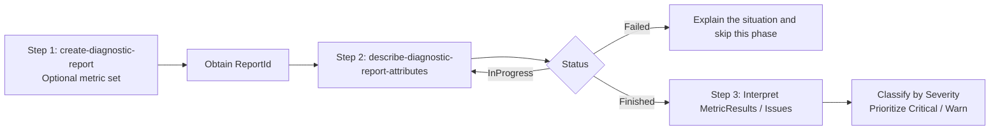

# Resource Diagnostic Report Usage Guide

ECS resource diagnostics are an official diagnostic capability provided by Alibaba Cloud. They perform a one-time health check on an instance by **diagnostic metric set (MetricSet)** and return a structured list of abnormalities. Use them to quickly identify common issues at the control-plane, network, or GuestOS layer before entering detailed GuestOS-internal investigation.

## Calling Workflow



## Step 1: Start Diagnostics

Before creating a report, validate `--biz-region-id`, `--resource-id`, optional `--metric-set-id`, optional time windows, and optional `--additional-options` according to `SKILL.md`. Use the plugin command `aliyun ecs create-diagnostic-report` to call the `CreateDiagnosticReport` OpenAPI action; it immediately returns `ReportId`.

The "Recommended Diagnostic Metric Sets" column in [`phenomenon-domain.md`](phenomenon-domain.md) lists the metric set to use for each phenomenon domain, which is the default set `dms-instancedefault` for most domains. To confirm that the set exists in the current region, or to look for a better match, enumerate the built-in sets. `--type` defaults to `User`, which returns only sets you created yourself, so **you must pass `--type Common` to list the built-in sets**:

```bash
aliyun ecs describe-diagnostic-metric-sets \
  --biz-region-id <region-id> \
  --type Common \
  --max-results 100 \
  --user-agent AlibabaCloud-Agent-Skills/alibabacloud-ecs-linux-os-troubleshooting/<session-id> \
  | jq -r '.MetricSets[] | select(.ResourceType=="instance") | "\(.MetricSetId) | \(.MetricSetName) | \(.Description)"'
```

Note that `MetricSets` is a flat array, that the display name field is `MetricSetName`, and that `MetricSetName` and `Description` may be `null`. Select a set whose `ResourceType` is `instance` and whose description matches the current phenomenon domain. If no better match exists, use the recommended value from `phenomenon-domain.md`.

```bash
aliyun ecs create-diagnostic-report \
  --biz-region-id <region-id> \
  --resource-id <instance-id> \
  [--metric-set-id <metric-set-id>] \
  --user-agent AlibabaCloud-Agent-Skills/alibabacloud-ecs-linux-os-troubleshooting/<session-id>
```

| Parameter | Description |
| --- | --- |
| `--biz-region-id` | **Required**. The region where the instance resides, such as `cn-hangzhou`. |
| `--resource-id` | **Required**. The ECS instance ID, such as `i-bp1xxxxxxxxxxxx`. |
| `--metric-set-id` | Optional. Diagnostic metric set ID. For values, refer to the "Recommended Diagnostic Metric Sets" column in [`phenomenon-domain.md`](phenomenon-domain.md). |
| `--start-time` / `--end-time` | Optional. Fill these in when the abnormal time window is clear. Use UTC and ISO8601. |
| `--additional-options` | Optional. Additional input parameters required by some diagnostic sets (key-value structure), such as target IP/port. Prefer using the aliyun CLI to query related data and populate this field; ask the user only if the data cannot be obtained. |

Return example:

```json
{
  "ReportId": "dr-bp1xxxxxxxxxxxxxxxx",
  "RequestId": "..."
}
```

## Step 2: Poll Report Status

Diagnostics usually complete within **30 seconds to 2 minutes**. Wait about 20 seconds before the first query. If the status is still `InProgress`, retry after another 10 to 20 seconds. Stop after 10 minutes or 30 attempts, then report the last observed status and skip this phase unless the user asks to keep waiting. Use the plugin command `aliyun ecs describe-diagnostic-report-attributes` to call the `DescribeDiagnosticReportAttributes` OpenAPI action. It returns per-metric results (`MetricResults`) and the `Additional` context for each Issue, which makes issue-level deep reading easier.

```bash
aliyun ecs describe-diagnostic-report-attributes \
  --biz-region-id <region-id> \
  --report-id <report-id> \
  --user-agent AlibabaCloud-Agent-Skills/alibabacloud-ecs-linux-os-troubleshooting/<session-id>
```

Returned `Status` values:

| Value | Meaning | Next action |
| --- | --- | --- |
| `InProgress` | Diagnostics in progress | Continue polling |
| `Finished` | Diagnostics completed | Interpret `MetricResults` and `Issues` |
| `Failed` | Diagnostics failed | Explain the situation to the user and skip this phase |

## Step 3: Interpret Diagnostic Results

Key fields in `DescribeDiagnosticReportAttributes`:

| Field | Meaning |
| --- | --- |
| `Severity` | Overall severity of the report. `Critical` > `Warn` > `Info` > `Normal` > `Unknown`. |
| `MetricSetId` | The diagnostic metric set ID that actually took effect. |
| `MetricResults.MetricResult[]` | Per-metric results for all metric items. Each item contains `MetricId` / `MetricCategory` / `Severity` / `Status` and the `Issues.Issue[]` hit by that metric. `Severity=Normal` means the metric has no abnormality and can be skipped. Prioritize `Critical` / `Warn` items. |
| `Issues.Issue[]` | Specific Issues that were hit. Each item contains `IssueId`, `Severity`, `OccurrenceTime`, and `Additional` (a JSON string carrying key context). |
| `StartTime` / `EndTime` | The diagnostic coverage time window (UTC). |

**Severity judgment**:

- `Critical`: key abnormalities detected by the kernel, usually strongly related to the phenomenon domain.
- `Warn`: highly suspected abnormalities that must be further verified with the phenomenon-domain document.
- `Info`: related contextual information that may be unrelated to the abnormality; do not draw a conclusion based on it alone.
- `Normal` / `Unknown`: no abnormality / not started or exited abnormally.
