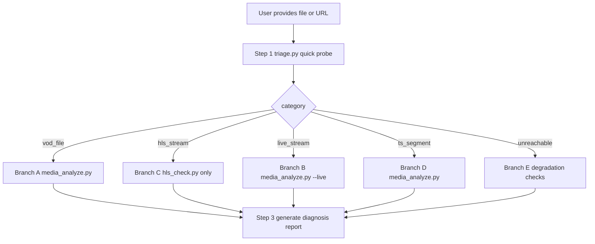

# Media Diagnostics

Diagnose playback problems in media files and streams. The skill runs a fast triage that classifies the input (VOD file / live stream / HLS stream / TS segment) and then dispatches the matching deep-analysis script. Detection covers moov atom position, codec compatibility, container structure, TS integrity, bitrate/frame-rate anomalies, audio-video sync, and live latency factors.

## Absolute Rules

- **Read-only**: this skill only inspects and reports. It never modifies, deletes, or re-encodes any file, and never pushes to any stream endpoint.
- **User-specified target only — ABSOLUTE PROHIBITION**: only the single file or URL explicitly provided by the user may be probed. When the target does not exist or is unreachable, do NOT list, search, or scan anything to locate it or a substitute: no directory listings (e.g. `ls -la /home/user/downloads/`), no file searches (`find /home/user -name "*.ts"`), no glob patterns (`glob **/broken_video.mp4`), no guessing URLs, no probing unspecified addresses. Instead take the `unreachable` degraded conclusion from triage directly and report why the given target failed.
- **No credentials**: no cloud credentials, API keys, or tokens are required, requested, or used. The skill never calls any cloud API.
- **No remediation execution**: repair commands (ffmpeg examples) are only *suggested* in the report. Never execute any repair/transcode command on the user's file without an explicit new instruction from the user.

## User Confirmation

- Before running any analysis, confirm the target file path or URL with the user.
- If the user describes symptoms but provides no file or URL, ask for one first. Never fabricate or derive a target on your own.
- If the target comes from task context rather than directly from the user, state the target and its source explicitly before running any check.

## Execution Principle

MANDATORY:

- **Single entry point**: every diagnosis MUST start with the triage script `scripts/triage.py`. It classifies the input and outputs the recommended follow-up scripts.
- **No bypassing triage**: never call `ffprobe`/`mediainfo` directly to draw conclusions, and never jump straight to a deep-analysis script without first running triage (except when explicitly re-running a single routed branch).
- **Follow the routed actions**: execute only the scripts listed in the triage `actions` field, with the arguments shown in the Orchestration section.
- **No fallback CLI chains**: if a script fails, report the failure and its stderr message. Do not hand-assemble alternative command chains.
- **Never install software**: never install software or packages (apt / pip / brew, or downloading binaries) during a diagnosis; if ffprobe is absent, use the degraded report and finish. This rule only constrains agent behavior inside the diagnosis session; it does not prevent the report from recommending that the user or their environment administrator install FFmpeg afterwards.

## Credentials

- **No credentials required.** All analysis runs locally against the user-provided file or URL using ffprobe/mediainfo and plain HTTP requests.
- This skill does not call any cloud API. Never ask the user for AccessKey, STS token, or any cloud configuration.

## Trigger Conditions

Use this skill when the user reports any of:

- "video file won't play"
- "video black screen or green screen"
- "moov atom position issue"
- "HLS m3u8 playlist check"
- "HLS segment corrupted"
- "live stream latency or stutter"
- "TS segment analysis"
- "video codec compatibility"
- "media file format diagnosis"
- "B-frame or GOP structure analysis"

## Input Parameters

| Parameter | Required | Description |
|-----------|----------|-------------|
| `<input>` | Yes | A local media file path, or a media URL explicitly provided by the user. Supported: local MP4/MOV/FLV/TS files, local `.m3u8` playlist files, `.m3u8` playlist URLs, HTTP(S) media URLs, and live protocol URLs (`rtmp://`, `rtsp://`, `srt://`). |

Dependencies: **ffprobe** (shipped with FFmpeg) is strongly recommended — when it is absent the scripts still run but emit a degraded report (deep analysis such as moov / codec / B-frame/GOP / bitrate is unavailable, only structural checks remain), and the report urges you or your environment administrator to install FFmpeg; the agent itself never installs anything during a diagnosis. **mediainfo** is optional (the scripts degrade gracefully without it); Python 3.8+.

## Module Index

| Module | Purpose | File |
|--------|---------|------|
| Knowledge Base | Root causes, investigation steps, and repair commands for common media problems | [references/knowledge-base.md](references/knowledge-base.md) |

> Load references on demand. Do not read the knowledge base unless the diagnosis needs root-cause detail or repair guidance.

## Orchestration & Execution Flow



### Step 1: Triage (always first)

```bash
cd $SKILL_DIR && python3 scripts/triage.py "$INPUT"
```

The triage output is JSON with `input_type`, `category`, `symptoms`, `actions`, `confidence`, and a `probe_summary`, plus the plain-language fields `summary`, `recommended_actions`, and `severity_human`. Route by `category`:

### Branch A: VOD file (category = "vod_file")

Symptoms: moov_not_faststart, hevc_codec, 10bit_pixel_format, variable_frame_rate, aac_he_profile, excessive_b_frames, full_scan.

```bash
cd $SKILL_DIR && python3 scripts/media_analyze.py "$INPUT"
```

Deep-analysis emphasis by symptom: moov position + faststart fix; codec compatibility impact + transcode option; r_frame_rate vs avg_frame_rate gap for VFR; full scan reports "no issues found" or lists latent risks.

### Branch B: Live stream (category = "live_stream")

Symptoms: b_frame_present, audio_non_aac_in_rtmp, aac_he_profile, live_general_check. Auto-detected for `rtmp://` / `rtsp://` / `srt://` inputs and FLV-over-HTTP live streams.

```bash
cd $SKILL_DIR && python3 scripts/media_analyze.py "$INPUT" --live
```

Live-mode checks: B-frame zero tolerance with estimated delay in ms, RTMP/FLV audio codec compliance (AAC required), keyframe interval / GOP size, and a latency factor summary.

### Branch C: HLS stream (category = "hls_stream")

Symptoms: hls_analysis, b_frame_present.

```bash
cd $SKILL_DIR && python3 scripts/hls_check.py "$M3U8_URL_OR_FILE"
```

`$M3U8_URL_OR_FILE` is the m3u8 playlist URL or a local `.m3u8` playlist file (both are supported by the command above). `hls_check.py` parses the playlist (master vs media), sample-checks segment reachability (HTTP HEAD), verifies segment duration consistency against targetDuration, sanity-checks DISCONTINUITY density, and samples TS segment structure (sync byte, PAT/PMT, 188-byte alignment) — this is the complete playlist-level diagnosis; take its conclusion and proceed to Step 3.

MANDATORY: do not run `media_analyze.py` on m3u8 URLs — ffprobe would sequentially download every segment of the stream (tens of minutes for long VOD playlists) and is not needed for playlist-level diagnosis. Deep container analysis belongs to Branch A (local files).

### Branch D: TS segment (category = "ts_segment")

Symptoms: ts_integrity_check.

```bash
cd $SKILL_DIR && python3 scripts/media_analyze.py "$INPUT"
```

Focus: continuity counter errors, PAT/PMT presence, and whether the file size is a multiple of 188 bytes.

### Branch E: Unreachable (category = "unreachable")

Symptoms: input_unreadable. Degradation path:

1. For URLs, verify reachability read-only, e.g. `curl -I "$URL"` (user-provided URL only).
2. Check whether the URL signature/query parameters may have expired, and suggest the user provide a fresh accessible URL.
3. For local files whose path does not exist, never search or scan directories to locate the file or a substitute; take the degraded conclusion as-is.
4. MANDATORY: run triage first, take its degraded conclusion, and report the blockage (root cause + what the user should fix, e.g. provide a fresh accessible URL or confirm the path). The routed deep-analysis scripts MAY be attempted on a best-effort basis — they degrade gracefully on unreadable input — but they are NOT required; a finished degraded report is a complete diagnosis. Never install software to compensate.

### Step 2: Symptom-only requests (no file yet)

When the user only describes a phenomenon, map it with the symptom routing table below, then ask for a file or URL and run Step 1.

| User description | Category | Likely symptoms |
|------------------|----------|-----------------|
| Playback stuttering / buffering / slow loading | vod_file | moov_not_faststart, bitrate_spike |
| Seek / scrub failure | vod_file | moov_not_faststart, flv_no_keyframe |
| Browser cannot play / unsupported format | vod_file | hevc_codec, 10bit |
| Glitching / mosaic / green screen | ts_segment | ts_continuity_error |
| Audio-video out of sync | vod_file | vfr, av_duration_mismatch |
| High live latency / slow first frame | live_stream | b_frame, large_gop |
| Stream push failure / audio errors | live_stream | audio_non_aac |
| Repeated frames / repeated segments | vod_file | cdn_reconnect_replay |
| HLS playback interruption | hls_stream | ts_integrity, segment_unreachable |

### Step 3: Report

Every script output is dual-friendly:

- **Machine-readable layer (stdout JSON)**: the structured fields described per branch above, plus three plain-language fields added on every path (success, error, and degraded): `summary` (one plain conclusion for non-technical users), `recommended_actions` (concrete next steps), and `severity_human` (`minor` / `needs attention` / `prompt attention`).
- **Human-readable layer (stderr)**: a formatted `=== Media Diagnosis Report ===` block with four sections — Plain conclusion / What we checked / Findings / What to do next — printed after the existing `[INFO]`/`[WARN]` lines.

Summarize base info (container, duration, bitrate, codecs, resolution), triage result, issues (with severity), warnings, and suggested repair commands. When presenting results to the user, lead with the plain `summary` and `recommended_actions`, and use the structured fields for routing or follow-up analysis. For root-cause detail and repair commands see [references/knowledge-base.md](references/knowledge-base.md).

MANDATORY: the final diagnosis answer must echo the exact target file path or URL the user provided, even on unreachable or degraded paths — never deliver a conclusion without naming the diagnosed target.

## Observability

- **stdout contract**: every script emits a single structured JSON document on stdout (triage result or full analysis). Parse stdout for machine-readable results. All scripts also include the plain-language fields `summary`, `recommended_actions`, and `severity_human` in that JSON — including on error and degraded paths (missing argument, fetch/parse failure, probe failure, missing external tool).
- **stderr contract**: progress and diagnostics are written to stderr only, prefixed with `[INFO]` or `[WARN]` (for example `[WARN]` when the optional `mediainfo` tool is absent, or when `ffprobe` is missing), followed by a formatted `=== Media Diagnosis Report ===` block (Plain conclusion / What we checked / Findings / What to do next). Never mix stderr text into JSON parsing.
- **Exit codes**: `0` success; `1` missing input or probe/fetch/parse failure — the structured JSON result is still printed on stdout (with the plain-language fields), a `[WARN]` line explaining the failure is written to stderr, and the process exits with code `1` (triage reports `category: "unreachable"` on this path); `127` required external tool missing — a degraded JSON result with the plain-language fields is still printed on stdout, carrying `category: "degraded"`. The `degraded` category is NOT a routing value for the Step 2 symptom table: do not route on it; follow its `recommended_actions` (surface the degraded conclusion, explain that deep analysis is unavailable without ffprobe, and strongly recommend that the user or their environment administrator install FFmpeg afterwards — the agent itself never installs software during a diagnosis).
- **User-Agent template**: every HTTP request directly issued by `hls_check.py` (the GET/HEAD requests against the m3u8 URL and its referenced segments) carries `User-Agent: AlibabaCloud-Agent-Skills/{skill-name}/{session-id}`, where `{skill-name}` is `alibabacloud-media-diagnostics`. Internal fetching performed by ffprobe against remote URLs is outside the scope of this declaration.
- **session-id**: a 32-character lowercase hex string generated once per script run (`uuid.uuid4().hex`) and shared unchanged by every HTTP request issued by `hls_check.py` in that run, so all requests of one diagnosis correlate.
- **HTTP behavior**: `hls_check.py` performs only GET/HEAD requests against the user-provided m3u8 URL and its referenced segments, with an explicit 15-second timeout per request. TS segment integrity sampling downloads at most 8 MB per segment (`MAX_SEGMENT_BYTES`), so total download volume is bounded to about 24 MB per run (3 sampled segments). Local `.m3u8` files are read from disk without any network request.

## Important Notes

- When triage returns `confidence: low`, combine the script output with the user's description before concluding; do not rely on the script verdict alone.
- Remote URL analysis depends on network availability; timeouts or expired URL signatures lead to the unreachable branch.
- Content-level problems (e.g. duplicated segments) cannot be auto-detected by triage; switch to manual investigation guided by the user's description.
- Repair commands in reports are suggestions only. Confirm with the user before they are applied, and never run them automatically.
- When ffprobe is missing, the delivered report is degraded: tell the user plainly which capabilities are unavailable (deep container/codec/frame analysis) and strongly recommend that they or their environment administrator install FFmpeg; do not install anything yourself.
- This skill performs no write operations and requires no credentials of any kind.
- MANDATORY: always echo the user-provided target file path or URL verbatim in the final answer, on every path (success, error, degraded).

## Examples

**Example 1**: User: "This MP4 loads very slowly online and the progress bar cannot be dragged, please check `/tmp/movie.mp4`."

```bash
cd $SKILL_DIR && python3 scripts/triage.py /tmp/movie.mp4
cd $SKILL_DIR && python3 scripts/media_analyze.py /tmp/movie.mp4
```

**Example 2**: User: "My HLS playback keeps interrupting, please check this playlist." (user provides the m3u8 URL)

```bash
cd $SKILL_DIR && python3 scripts/triage.py "https://cdn.example.com/vod/index.m3u8"
cd $SKILL_DIR && python3 scripts/hls_check.py "https://cdn.example.com/vod/index.m3u8"
```

**Example 3**: User: "Our live stream latency is too high, please diagnose the ingest stream." (user provides the push URL)

```bash
cd $SKILL_DIR && python3 scripts/triage.py "rtmp://push.example.com/live/stream1"
cd $SKILL_DIR && python3 scripts/media_analyze.py "rtmp://push.example.com/live/stream1" --live
```
