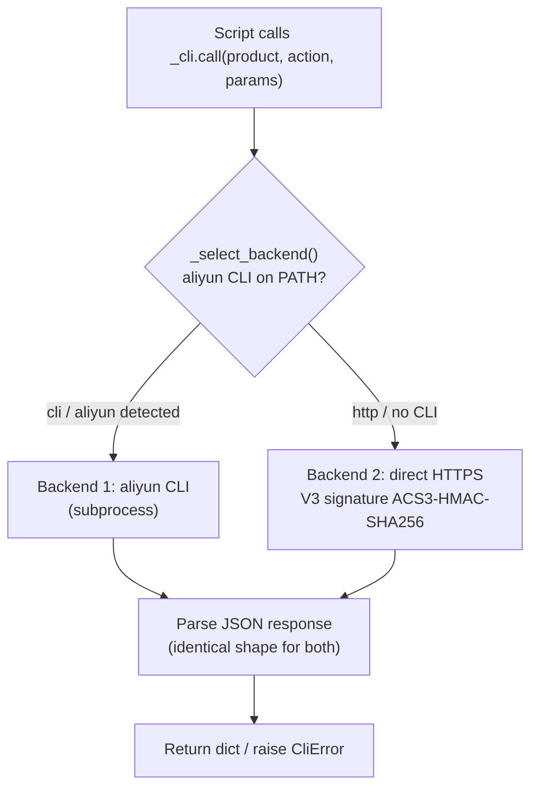
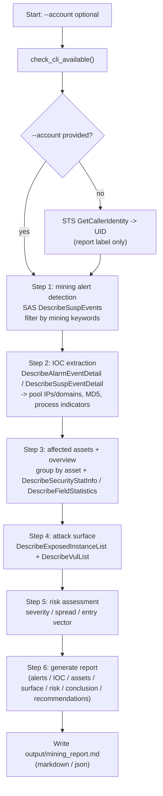

# Detection Flow (Dual-Backend, SAS Public API Edition)

This document captures the end-to-end runtime flow of the mining-attack
detection & diagnosis skill: the shared dual-backend dispatch layer and the
6-step Security Center (SAS)-based orchestrator.

All Alibaba Cloud API calls go through a single entry point, `_cli.call()`, so
the business scripts never need to know whether the request was served by the
aliyun CLI or by the direct V3-signed HTTPS fallback. The only data source is
Security Center (SAS); the skill is strictly READ-ONLY.

---

## 1. Dual-Backend Dispatch Layer

Every SAS / STS call funnels through `_cli.call()`.

- Backend is chosen once per process and cached.
- Credentials: CLI backend uses the aliyun profile (`~/.aliyun/config.json`);
  HTTP fallback resolves env AK/SK (+ optional security token) or config.json.
- The AccessKey Secret / security token are used only for signing and are
  never printed or logged.
- Pagination: SAS list APIs use `CurrentPage`/`PageSize`/`PageInfo.TotalCount`,
  handled by `_cli.paginate_page()`.

---

## 2. Six-Step Detection & Diagnosis Orchestrator — `mining_investigation.py`

`--account` is optional and auto-derived (display/report label only) via STS.

---

## Key Notes

- **Backend is transparent to business logic** — all calls route through
  `_cli.call()`; scripts do not care whether CLI or HTTP served the request.
- **UID is display-only** — the auto-derived UID is used purely for report /
  log labeling; queries are scoped to the account bound to the credential.
- **No write operations** — this skill is strictly read-only; it never marks
  alerts as handled, quarantines files, kills processes, or isolates hosts.
  When mining activity is confirmed, `mining_investigation.py` prints a
  prominent URGENT banner at the top of the report telling the operator to
  manually **isolate** the host, **kill** the miner, **block** pool IOCs, and
  **patch** the entry vulnerability.
- **IOC preservation** — mining-pool IPs/domains, sample hashes, and malicious
  process names are NOT masked (they carry forensic value). Only account-scoped
  identifiers (UID, asset uuid) are masked via `_cli.mask_sensitive()`. Set
  `MINING_NO_MASK=1` to emit raw values.
