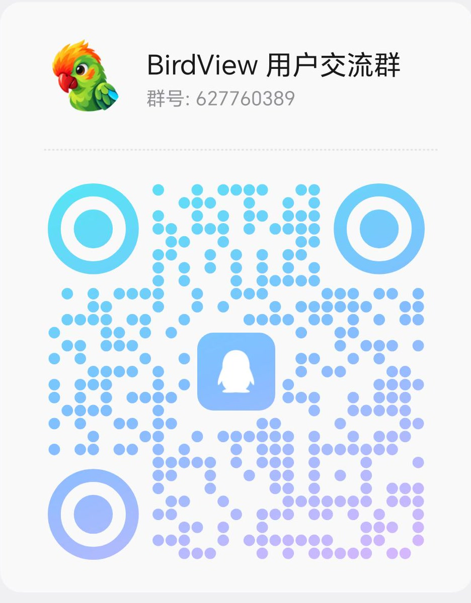

<div align="center">
  
  <h1>Birdview</h1>
  <p><strong>Transform your development workflow with Birdview! Shift your focus from code to architecture—and break open the black box of AI coding!</strong></p>
  <p><strong>The last advantage of coding by hand was architectural awareness—Birdview has eliminated that reason entirely.</strong></p>
  <p><strong>The future of programming comes down to just two things: constraints and architecture.</strong></p>
  <p>
    
    
    
    
    
    <a href="https://linux.do"></a>
  </p>
</div>

<p align="center">
  <a href="#quick-start">Quick Start</a> ·
  <a href="#how-it-works">How It Works</a> ·
  <a href="examples/harness-activity.html">Live Demo</a> ·
  <a href="https://qiuner.github.io/birdview/">Project Site</a> ·
  <a href="README.zh.md">简体中文</a>
</p>

<!-- [简体中文](README.zh.md) -->

Birdview is a skill for AI coding agents that brings **architecture and constraints** into one reviewable view. It helps you understand how a project is organized, which rules apply, and what the agent plans to change. For coding tasks, the agent displays the map and change plan, waits for your confirmation, then implements and records verification results. The output is a standalone, interactive HTML page that opens in a browser without deploying a service.

**[Project site](https://qiuner.github.io/birdview/):** [qiuner.github.io/birdview](https://qiuner.github.io/birdview/) · **[Topics](https://github.com/Qiuner/birdview#readme):** `agent-tools` `architecture-as-code` `code-visualization` `coding-agents` `developer-tools` `software-architecture`

For example, invoke Birdview to "add rate limiting to the login endpoint":

- Normal flow: the AI searches and edits immediately, leaving you to inspect the final diff for missed or unrelated changes.
- Birdview flow: the AI shows the login modules, applicable interface and security rules, planned files, and supporting evidence. It waits for you to confirm that scope, then implements and records the checks it actually ran.

Birdview does not automatically observe every agent action, and it does not replace Git diffs, tests, or code review. It puts the agent's understanding of the system and its declared change scope on one architecture map, so scope mistakes can be caught before the implementation is finished.

<p align="center">
  
</p>

> The screenshot uses the fictional agent harness included in this repository. It does not represent observed production activity.

## What Birdview Shows

Logs tell you which actions the AI took, and diffs tell you which lines changed. Neither directly answers: where does this change sit in the system, what else can it affect, and why did the AI decide these files belong to the task?

Birdview puts those answers on one page:

- **System map:** the modules in the project, what each owns, and how they connect.
- **Project constraints:** reviewed rules, their conditions, explanations, source evidence and tracked versions.
- **Reading coverage:** which sources were collected and reviewed, and what remains uncertain or uninspected.
- **Current change:** the modules and files the agent says it will touch, plus its current step.
- **Source evidence:** the files or code locations behind each architectural claim.
- **Comparison:** the full architecture and current change scope on the same layout.
- **Verification:** the checks the agent actually ran and whether they passed.

The integrated HTML offers architecture and constraint views, light and dark themes, module details, and Chinese and English controls. Inputs are checked for structure and consistency before rendering. The CLI also exports an auxiliary source index. Collected documents are not automatically effective rules, and displaying a rule does not prove the implementation satisfies it.

## Quick Start

Install it with the third-party `skills` CLI:

```sh
npx skills add Qiuner/birdview --skill birdview
```

Start a new agent task and explicitly invoke the skill. **By default, Birdview runs only when requested; ordinary edits do not trigger it unless you enable project auto mode.**

**Codex:** type `/skills` and select Birdview, or enter:

```text
$birdview Show this project's architecture and constraints; do not edit code.
```

**Claude Code:** enter:

```text
/birdview Show this project's architecture and constraints; do not edit code.
```

For DeepSeek Harness and other hosts, use their skill selector or explicitly ask to use Birdview. Slash-command support depends on the host.

Check that the agent delivers a browser-readable page containing architecture and reviewed constraints, with source evidence and review gaps. If constraints cannot be reviewed, it should explain the missing coverage instead of inventing rules. Map-only requests stop after delivery; coding requests wait for your confirmation of the displayed plan. See the [installation guide](docs/installation.md) for complete Codex, Claude Code, and DeepSeek Harness setup and verification steps. See the [0.3.1 release notes](docs/release-notes-0.3.1.md) for this release's features and limitations.

### Run the Demo from Source

Developing Birdview or running the bundled demo requires Node.js 18 or newer:

```sh
npm ci
npm run validate:examples
npm test
npm run build:demo
```

Open [`examples/harness-activity.html`](examples/harness-activity.html) in a browser. The project and agent activity shown in the demo are simulated.

## Community and Feedback

For installation help, inaccurate architecture maps, or discussion about Architecture-first Coding, join the Birdview user community.

<p align="center">
  
</p>

<p align="center"><strong>QQ group: 627760389</strong></p>

You can also [share feedback on GitHub](https://github.com/Qiuner/birdview/issues/new?template=usage_feedback.yml). Successful runs, missing modules, incorrect relationships, and installation problems are all welcome. No private source code is needed; screenshots and sanitized examples are optional.

## Viewer Guide

On an integrated page, switch between **Architecture** and **Constraints**. Architecture includes the full map and, when activity is supplied, changes and side-by-side comparison. Select a module to inspect responsibilities, files and evidence. Activity history records the agent-declared plan, progress and checks.

In Constraints, browse **by topic** to understand rules, or **by directory** to trace their files. Double-click a node to read its explanation or source text, and use **Coverage** to inspect the reviewed scope and gaps. Role colors match the architecture palette; they do not represent compliance.

On the first visit, follow **Guide** for a short walkthrough, or skip it and press Escape at any time. You can reopen it later from the toolbar.

## Explicit Invocation

Once activated in either mode, Birdview displays the map and proposed changes, then waits for your confirmation before editing code. Confirmed work continues without repeated prompts within the same scope; material scope changes require a new confirmation. Map-only requests end after delivery. This is agent guidance, not a write lock enforced by the HTML page.

Birdview runs **on demand by default**. Ordinary coding, small fixes and feature planning do not trigger it unless project auto mode is enabled.

- **Codex:** type `/skills` and select Birdview, or mention `$birdview`.
- **Claude Code:** invoke the installed skill with `/birdview`.
- **DeepSeek Harness and other hosts:** use the host skill selector or explicitly ask to use Birdview; slash-command support depends on the host.

For example: “Use Birdview to show this project's architecture and constraints without changing code.” Selection applies to the current task, not future edits. The skill checks project mode before starting its workflow; host invocation policy permits opt-in auto mode.

Auto mode is optional: it activates before every code change, including small edits, and planning that explicitly analyzes affected modules. New projects default to on-demand. Existing `Birdview mode: auto` blocks in `AGENTS.md` or `CLAUDE.md` remain effective. Choose or query project mode:

```sh
node <skill-root>/scripts/birdview.mjs mode auto --project <project-root>
node <skill-root>/scripts/birdview.mjs mode on-demand --project <project-root>
node <skill-root>/scripts/birdview.mjs mode --project <project-root>
```

Setup defaults new projects to `on-demand` and preserves existing `auto`, `on-demand` or `off` settings. Codex and DeepSeek Harness use `AGENTS.md`; add `--agent claude-code` for `CLAUDE.md`. Other projects are not rewritten automatically. Start a new task after upgrading. See [mode details](references/modes.md).

## Generate the HTML Directly

The agent normally handles these steps. If you already have an architecture file in the expected format, you can validate it and generate the HTML yourself:

```sh
node scripts/validate.mjs .birdview/architecture.json
node scripts/render.mjs .birdview/architecture.json .birdview/architecture.html
```

To also show the task activity declared by the agent, add an activity history:

```sh
node scripts/validate.mjs .birdview/architecture.json .birdview/activity.jsonl
node scripts/render.mjs .birdview/architecture.json .birdview/activity.html .birdview/activity.jsonl
```

To include an already collected and reviewed constraint catalog:

```sh
node scripts/render.mjs .birdview/architecture.json .birdview/project.html --constraints .birdview/constraints.reviewed.json
```

The CLI writes the integrated page and a companion `project.sources.html` export. For source discovery, rule review and standalone constraint rendering, see the [constraint workflow](references/constraint-graph.md).

Add `--bilingual` when both Chinese and English content must be validated. Use `--simulation` only to mark fictional demo activity.

## How It Works

```text
project source ─────> architecture.json ──────┐
local rules + review > constraints.reviewed.json ├─> validate / render ─> HTML
agent declarations ─> activity.jsonl ─────────┘
```

`architecture.json` describes project modules, responsibilities, file ownership, source evidence, and relationships. The optional `activity.jsonl` records the task scope, current target, progress, and verification results declared by the agent, one event per line. `constraints.reviewed.json` carries collected sources, reviewed rules and coverage. Rendering validates the supplied data before generating HTML.

The user-facing workflow has four steps:

1. **Understand architecture and constraints:** read source and local instructions, reuse or update the map, and disclose review gaps.
2. **Show the plan:** identify affected modules/files, intended behavior, applicable rules and proposed checks.
3. **Confirm the scope:** wait for your explicit confirmation in the conversation before implementation. Reuse confirmation of the same plan; confirm material scope changes again.
4. **Implement and verify:** work within the confirmed scope, record actual checks and report remaining limitations.

Confirmation does not mean tests passed. You can explicitly waive the confirmation step for a particular task; simply asking for a feature or enabling auto mode is not such a waiver.

See [Stage 1: Map a project](references/map-project.md) and [Stage 2: Show changes](references/show-changes.md) for the complete workflow.

## Data Contracts

| Artifact | Purpose |
| --- | --- |
| `architecture.json` | Project identity, modules, ownership, evidence, relationships, groups, and stable layout |
| `constraints.reviewed.json` | Collected sources, reviewed rules, applicability, version information and review coverage |
| `activity.jsonl` | Ordered, agent-declared task scope, targets, files, phases, and verification records |
| `architecture.html` | Generated viewer containing the map, optional constraint catalog and activity history |

The schemas enforce structure. [`scripts/validate.mjs`](scripts/validate.mjs) also checks cross-record rules such as stable map identity, contiguous sequences, valid scope and targets, file ownership, and consistent check results. Validation does not prove that architecture claims are true or that referenced source files exist.

## Project Layout

| Path | Contents |
| --- | --- |
| [`src/`](src) | TypeScript sources for contracts, CLI tools, browser viewer and website |
| [`schemas/`](schemas) | Architecture and activity JSON Schemas |
| [`scripts/`](scripts) | Validator, standalone renderer, and documentation checks |
| [`assets/`](assets) | Viewer templates, styles and generated browser bundles |
| [`examples/`](examples) | Fictional maps, activity records, and the generated interactive demo |
| [`references/`](references) | Authoring workflow, contract, activity, and bilingual guidance |
| [`test/`](test) | Contract, rendering, and optional browser-level checks |

## Current Boundaries

Birdview 0.3.1 uses file snapshots:

- Collected sources, rule applicability and verified compliance are distinct; incomplete review must be disclosed.
- User confirmation is recorded in the conversation, not enforced by an HTML approval button or filesystem lock.
- Activity is declared by an agent; Birdview does not automatically observe coding operations.
- Updates require regenerating the HTML and refreshing the browser.
- Live transport, automatic refresh, and rendered-display acknowledgements are not implemented.
- A `completed` event does not prove checks passed; only recorded check results make that claim.
- The package is currently marked private and is not published to npm.

## Development

```sh
npm test                 # Contract and renderer tests
npm run validate:examples
npm run build:demo       # Rebuild the fictional activity demo
node scripts/check-docs.mjs
```

Browser-level checks live in [`test/viewer.browser.mts`](test/viewer.browser.mts) and require a local Playwright installation or `BIRDVIEW_PLAYWRIGHT_PATH` pointing to one.

For the field semantics and invariants, read the [Birdview contract](references/contract.md). Documentation changes must follow the bilingual rules in [CONTRIBUTING.md](CONTRIBUTING.md).

## License

Released under the [MIT License](LICENSE). Copyright (c) 2026 Qiuner.
Third-party notices are preserved in [THIRD_PARTY_NOTICES](THIRD_PARTY_NOTICES).

For release preparation, see the [release checklist](docs/releasing.md).
