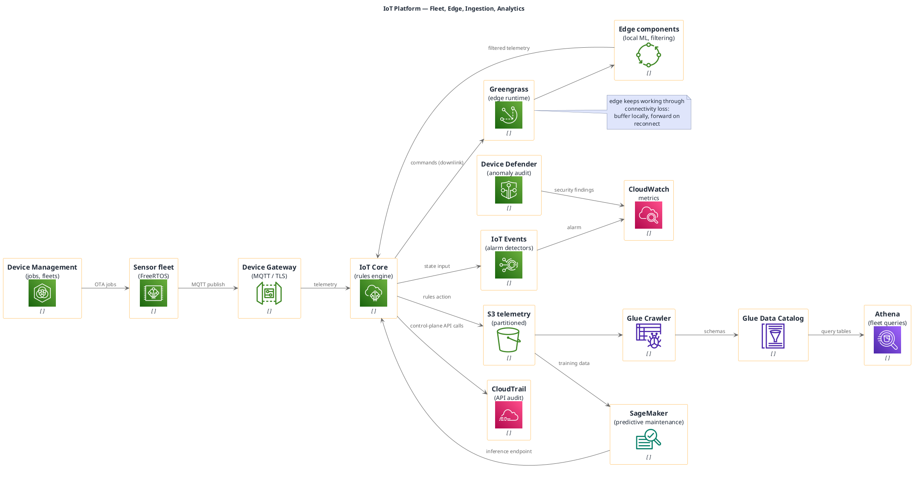

# IoT Platform (AWS, portable icons)

**Best for**: showing the device → edge → cloud path with fleet management and analytics in one view
**Avoid when**: the reader needs firmware internals or a pure network topology
**Answers**: how devices connect, where data is processed, and how the fleet is managed and updated

## Key Options

| Syntax | Effect |
|---|---|
| `!include <awslib/InternetOfThings/all.puml>` | `IoTCore`, `IoTEvents`, `IoTDeviceManagement`, `IoTDeviceDefender`, `IoTGreengrass*`, `FreeRTOS`, `IoTButton`, `IoTAnalytics*` |
| `!include <awslib/Analytics/all.puml>` | `Glue*`, `Athena`, `Kinesis*`, `Redshift`, `QuickSight` |
| `!include <awslib/MachineLearning/all.puml>` | `SageMaker*` — the ML step of a predictive-maintenance pipeline |
| `left to right direction` | Device → edge → cloud → analytics reads naturally |
| Two-way edges | Uplink telemetry and downlink commands are separate labelled edges — do not merge them |

## Data Shape

Five stages: **devices → edge → cloud ingestion → storage/analytics → operations**. Management is a cross-cutting
band (fleet jobs, security audit) that touches devices and ingestion without being on the data path.

## Pitfalls

- ❌ One-way telemetry only → ✅ show the downlink (commands, OTA jobs); IoT without control is telemetry, not IoT
- ❌ Skipping the edge runtime → ✅ edge processing answers the latency/connectivity story — it is the interesting part
- ❌ Raw telemetry queried directly → ✅ land in S3 then catalog it; that is why Athena appears downstream of Glue
- ❌ No device identity/certificates → ✅ mention certificates (edge/device) in a note; reviewers ask for the trust model

## Alternatives

| Variant | Use instead |
|---|---|
| Fleet analytics only | `data-platform-lakehouse.md` |
| Edge site network layout | `network-topology-enterprise.md` |
| Device lifecycle states | A state machine diagram |

<!-- source: draw-uml-dev fixtures/plantuml/stdlib/aws/019/020/021/022 (InternetOfThings) + 001 (Analytics) + 023 (MachineLearning) macro lists -->
