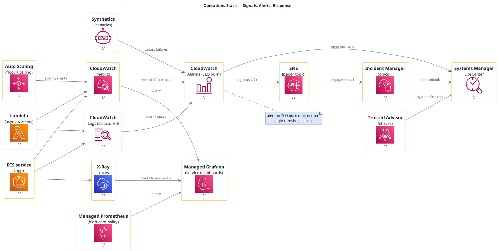

# Operations and Observability (AWS, portable icons)

**Best for**: SRE/platform audiences — what is measured, what alerts, and how an incident is handled
**Avoid when**: the audience needs the application flow (use the serverless or deployment example)
**Answers**: which signals exist, what turns them into alerts, and who acts on them

## Key Options

| Syntax | Effect |
|---|---|
| `!include <awslib/ManagementGovernance/all.puml>` | `CloudWatch`, `CloudWatchLogs`, `CloudWatchAlarm`, `CloudWatchSynthetics`, `ManagedGrafana`, `ManagedServiceforPrometheus`, `SystemsManager*`, `TrustedAdvisor` |
| `!include <awslib/DeveloperTools/all.puml>` | `XRay`, `Code*` family — tracing belongs to this family in awslib |
| `!include <awslib/ApplicationIntegration/all.puml>` | `SimpleNotificationService` (paging topic) |
| `hide stereotype` | Keeps the picture clean when many families are mixed |
| Note placement | `note right of X` works in node-edge diagrams; in activity/swimlane diagrams use `note right` |

## Data Shape

Three bands: **workloads → signals → analysis**, with a response chain that turns alerts into owned incidents.
Every alerting edge should end at a human-facing object (page / ops item), otherwise the diagram has no owner.

## Pitfalls

- ❌ Paging on every threshold → ✅ alert on SLO burn rate; note it, because it is the design decision being reviewed
- ❌ Metrics without logs/traces → ✅ all three signals, because each answers a different failure question
- ❌ No runbook link → ✅ connect incidents to OpsCenter/runbooks; an alert without an action is noise
- ❌ Trusted Advisor as decoration → ✅ wire its findings into the ops queue, or leave it out

## Alternatives

| Variant | Use instead |
|---|---|
| Runtime topology (nodes, zones, replicas) | `runtime-deployment-topology.md` |
| Delivery pipeline signals | `cicd-pipeline.md` |
| SLO summary for stakeholders | An infocard metric card |

<!-- source: draw-uml-dev fixtures/plantuml/stdlib/aws/024/025/026 (ManagementGovernance) + 014 (DeveloperTools) + 010 (Containers) macro lists -->
