# Data Platform (Lakehouse on AWS)

**Best for**: data engineering audiences — ingestion, lake storage, transformation, warehouse and BI in one view
**Avoid when**: the reader is a business stakeholder (use a data lineage card instead) or the diagram must show non-AWS tooling
**Answers**: where data enters, where it lands, how it is transformed, and how it reaches consumers

```plantuml
@startuml
skinparam DefaultFontColor #1f2937
skinparam ArrowColor #5b6b8c
skinparam ArrowFontColor #1f2937
skinparam RectangleBackgroundColor #eef2fb
skinparam RectangleBorderColor #5b6b8c
skinparam RectangleFontColor #1f2937
skinparam ComponentBackgroundColor #eef2fb
skinparam ComponentBorderColor #5b6b8c
skinparam ComponentFontColor #1f2937
skinparam ClassBackgroundColor #eef2fb
skinparam ClassBorderColor #5b6b8c
skinparam ClassFontColor #1f2937
skinparam UsecaseBackgroundColor #eef2fb
skinparam UsecaseBorderColor #5b6b8c
skinparam UsecaseFontColor #1f2937
skinparam DatabaseBackgroundColor #eef2fb
skinparam DatabaseBorderColor #5b6b8c
skinparam DatabaseFontColor #1f2937
skinparam NodeBackgroundColor #eef2fb
skinparam NodeBorderColor #5b6b8c
skinparam NodeFontColor #1f2937
skinparam ActorBackgroundColor #eef2fb
skinparam ActorBorderColor #5b6b8c
skinparam ActorFontColor #1f2937
skinparam StateBackgroundColor #eef2fb
skinparam StateBorderColor #5b6b8c
skinparam StateFontColor #1f2937
skinparam ArtifactBackgroundColor #eef2fb
skinparam ArtifactBorderColor #5b6b8c
skinparam ArtifactFontColor #1f2937
skinparam CloudBackgroundColor #eef2fb
skinparam CloudBorderColor #5b6b8c
skinparam CloudFontColor #1f2937
skinparam FolderBackgroundColor #eef2fb
skinparam FolderBorderColor #5b6b8c
skinparam FolderFontColor #1f2937
skinparam PackageBackgroundColor #eef2fb
skinparam PackageBorderColor #5b6b8c
skinparam NoteBackgroundColor #dfe5fb
skinparam NoteBorderColor #5b6b8c
skinparam NoteFontColor #1f2937
skinparam stereotypeABackgroundColor #d9e3f4
skinparam stereotypeABorderColor #5b6b8c
skinparam stereotypeCBackgroundColor #d9e3f4
skinparam stereotypeCBorderColor #5b6b8c
skinparam stereotypeEBackgroundColor #d9e3f4
skinparam stereotypeEBorderColor #5b6b8c
skinparam stereotypeIBackgroundColor #d9e3f4
skinparam stereotypeIBorderColor #5b6b8c
!include <awslib/AWSCommon>
!include <awslib/Analytics/all.puml>
!include <awslib/Storage/all.puml>
!include <awslib/ApplicationIntegration/all.puml>
!include <awslib/Database/all.puml>

hide stereotype
left to right direction
title Data Platform — Batch and Streaming Lakehouse

' ── Sources ──
SimpleQueueService(txnQueue, "Transaction events", " ")
SimpleNotificationService(appEvents, "Application events", " ")

' ── Streaming ingestion ──
KinesisDataStreams(stream, "Kinesis Data Streams", " ")
KinesisFirehose(firehose, "Kinesis Firehose", " ")
ManagedStreamingforApacheKafka(msk, "MSK (Kafka)", " ")

' ── Batch ingestion ──
DatabaseMigrationService(dms, "DMS (CDC)", " ")
GlueDataBrew(dataBrew, "Glue DataBrew\n(profiling)", " ")

' ── Lake ──
SimpleStorageServiceBucket(rawBucket, "S3 raw zone", " ")
SimpleStorageServiceBucket(curatedBucket, "S3 curated zone", " ")
SimpleStorageServiceGlacier(archive, "S3 Glacier\n(archive)", " ")

' ── Catalog + transform ──
GlueDataCatalog(catalog, "Glue Data Catalog", " ")
Glue(glue, "Glue ETL jobs", " ")
GlueCrawler(crawler, "Glue Crawler", " ")
ManagedWorkflowsforApacheAirflow(mwaa, "MWAA\n(orchestration)", " ")

' ── Serving ──
Redshift(warehouse, "Redshift\n(warehouse)", " ")
Athena(athena, "Athena\n(ad-hoc SQL)", " ")
OpenSearchService(opensearch, "OpenSearch\n(search)", " ")
QuickSight(bi, "QuickSight\n(BI)", " ")

' ── Flow ──
txnQueue --> stream
appEvents --> stream
msk --> stream
stream --> firehose : micro-batch
firehose --> rawBucket : Parquet
dms --> curatedBucket : CDC files
dataBrew --> rawBucket : cleaned

rawBucket --> crawler
crawler --> catalog : schemas
catalog --> glue : table metadata
glue --> curatedBucket : transform
curatedBucket --> warehouse : load
curatedBucket --> athena : query
curatedBucket --> opensearch : index
warehouse --> bi : dashboards
athena --> bi : datasets
curatedBucket --> archive : lifecycle rule
mwaa --> glue : schedule
mwaa --> dms : schedule

note right of catalog
  single source of truth for schemas:
  every consumer resolves tables through the catalog
end note
@enduml
```

## Key Options

| Syntax | Effect |
|---|---|
| `!include <awslib/AWSCommon>` | **Always required** before any awslib macro |
| `!include <awslib/<Category>/all.puml>` | Include the category file that defines the macros you use (`Analytics`, `Storage`, `Database`, `ApplicationIntegration`, …) |
| `MacroName(alias, "Label", " ")` | awslib macro call — the third argument is the resource/secondary line (a single space if unused) |
| `hide stereotype` | Hides the `<<stereotype>>` labels that awslib macros attach (keeps the diagram clean) |
| `left to right direction` | Data pipelines read left→right (source → ingest → transform → serve) |
| Long macro names | awslib uses **official long names**: `SimpleStorageServiceBucket`, `SimpleQueueService`, `KinesisDataStreams` — not `S3`/`SQS` |

## Data Shape

A left-to-right pipeline with **three vertical bands**: ingestion (queue/stream/CDC) → lake + catalog → serving
(warehouse/search/BI). Zones are S3 buckets, and the catalog sits in the middle because every consumer resolves
schemas through it.

## Pitfalls

- ❌ Using short names (`S3(...)`, `SQS(...)`) → ✅ awslib macros are the long official names (`SimpleStorageServiceBucket(...)`)
- ❌ Forgetting a category include → ✅ each macro needs its category file; missing includes fail silently to text
- ❌ Drawing the lake as one bucket → ✅ separate raw / curated (and archive) zones — that is the lakehouse contract
- ❌ Mixing `mxgraph.aws4.*` icons with awslib macros in one diagram → ✅ pick one icon system per diagram
- ❌ `note bottom of X` / `note top of X` → ✅ use `note right of X` or `note left of X`: when a diagram also contains a
  **labelled arrow** (`A --> B : text`), the bottom/top note form is routed to the sequence renderer and fails with
  `Unsupported sequence note position`

## Alternatives

| Variant | Use instead |
|---|---|
| Modern serverless-style architecture with `mxgraph.aws4` icons | `aws-serverless-architecture.md` |
| ML training/serving path | `machine-learning-pipeline.md` |
| Data contracts and lineage as a card | An infocard or GFM table for the column-level detail |

<!-- source: draw-uml-dev fixtures/plantuml/stdlib/aws/{001 Analytics, 012 Database, 002 ApplicationIntegration, 034/035 Storage}.puml (macro names verified verbatim) -->
