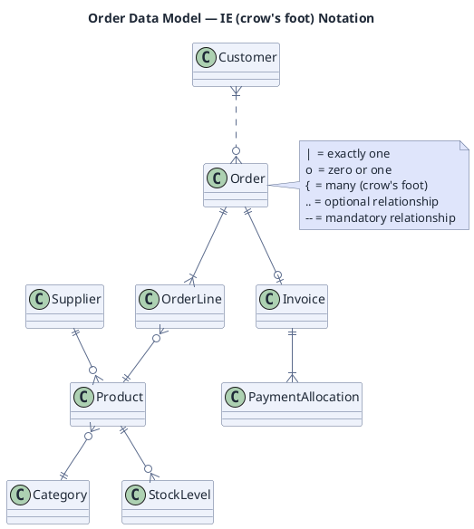

# Entity Relationships (Information Engineering notation)

**Best for**: data models where cardinality is the message — one-to-many, optional, mandatory
**Avoid when**: you need entity attributes in the same diagram (use a class diagram for attributes, or a separate data dictionary)
**Answers**: which entities exist and how many of each relate to each other

## Key Options

| Syntax | Effect |
|---|---|
| `A }|..|| B` | Crow's-foot on A's side, single bar on B's side (many-to-one), optional (`..`) vs mandatory (`--`) |
| `\|` / `o` / `{` / `}` | Cardinality markers: bar = one, circle = zero (optional), crow's foot = many |
| `--` vs `..` | Mandatory vs optional relationship |
| `note right of X` | Put the notation legend here — readers of data diagrams ask about it every time |
| Entity naming | Singular nouns, no verbs (`Order`, not `Orders`) |

## Data Shape

A relationship graph of entities. Attributes are deliberately absent: in IE notation the value is the cardinality
contract, and mixing attributes in makes the diagram unreadable at more than ~8 entities.

## Pitfalls

- ❌ Using `erDiagram`-style syntax from other tools → ✅ this engine supports the PlantUML IE/crow's-foot relation syntax only
- ❌ Assuming attributes can be attached to entities → ✅ verify first; in this engine the IE fixtures are relationship-only
- ❌ Mixing IE and class diagrams in one figure → ✅ pick one notation per diagram
- ❌ Cardinality direction mistakes → ✅ read `A }|..|| B` as "many A relate to exactly one B"

## Alternatives

| Variant | Use instead |
|---|---|
| Entities with attributes and methods | `domain-class-model.md` (class diagram) |
| Data flow rather than data model | `data-platform` pipeline diagrams (plantuml + AWS analytics stencils) |
| Schema documentation for readers | A GFM table or an infocard `matrix-table` |

<!-- source: draw-uml IE fixtures (ie-diagram/ 6 cases, verified against official PlantUML baselines) -->
