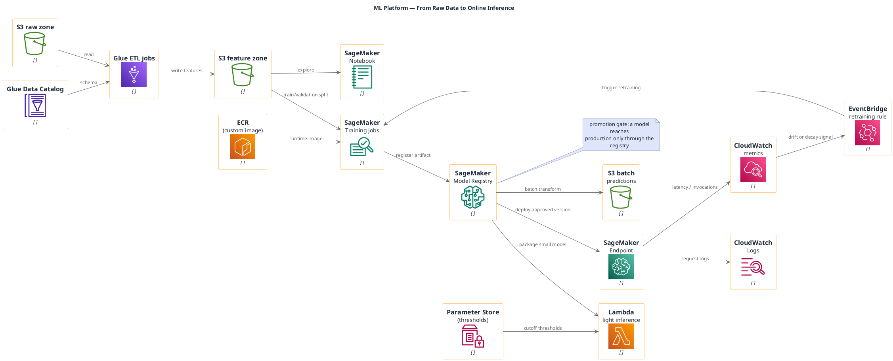

# Machine Learning Pipeline (AWS)

**Best for**: ML platform audiences — data preparation, training, model registry and inference in one view
**Avoid when**: the reader is a business stakeholder (show a KPI card instead) or the model itself is the topic
**Answers**: how data becomes a trained model, where artifacts live, and how the model reaches production

## Key Options

| Syntax | Effect |
|---|---|
| `!include <awslib/MachineLearning/all.puml>` | SageMaker family macros (`SageMaker`, `SageMakerTrain`, `SageMakerModel`, `SageMakerNotebook`, `SageMakerCanvas`) |
| `!include <awslib/Compute/all.puml>` | Required for `Lambda(...)` in the serving band |
| `!include <awslib/ApplicationIntegration/all.puml>` | Required for `EventBridge(...)` and other integration/messaging macros |
| `!include <awslib/Containers/all.puml>` | `ElasticContainerRegistry`, `ElasticContainerService*` |
| `!include <awslib/ManagementGovernance/all.puml>` | `CloudWatch`, `CloudWatchLogs`, `SystemsManagerParameterStore`, `TrustedAdvisor*` |
| Portable | awslib is part of the **official PlantUML stdlib** — this diagram renders in any PlantUML tool, not only in Markdown Viewer |
| `left to right direction` | Keeps the data → model → serving progression readable |

## Data Shape

Three bands: **data** (lake + catalog + ETL) → **experimentation** (notebook → training → registry) →
**serving** (endpoint / batch / function). Operations sits below with a feedback edge back into training.

## Pitfalls

- ❌ Deploying straight from a training job → ✅ route through a model registry; it is the promotion gate
- ❌ No feedback loop → ✅ add the drift/metric edge back into training, otherwise the diagram implies a frozen model
- ❌ Mixing training and serving infrastructure → ✅ separate bands make cost and scaling decisions visible
- ❌ Forgetting a category include → ✅ every awslib macro must come from a loaded family; `Lambda(...)` needs `Compute/all.puml`
- ❌ Guessing the family for orchestration/events → ✅ `EventBridge(...)` belongs to `ApplicationIntegration/all.puml`
- ❌ Omitting the runtime image → ✅ custom training/serving images come from a registry (`ElasticContainerRegistry`)

## Alternatives

| Variant | Use instead |
|---|---|
| Data pipeline without ML | `data-platform-lakehouse.md` |
| Serving architecture only | Cloud architecture examples with `mxgraph.aws4` icons |
| Model card / metrics summary | An infocard `metric-board` style card |

<!-- source: draw-uml-dev fixtures/plantuml/stdlib/aws/023 (MachineLearning) + 010/014/025 macro lists (names verified verbatim) -->
