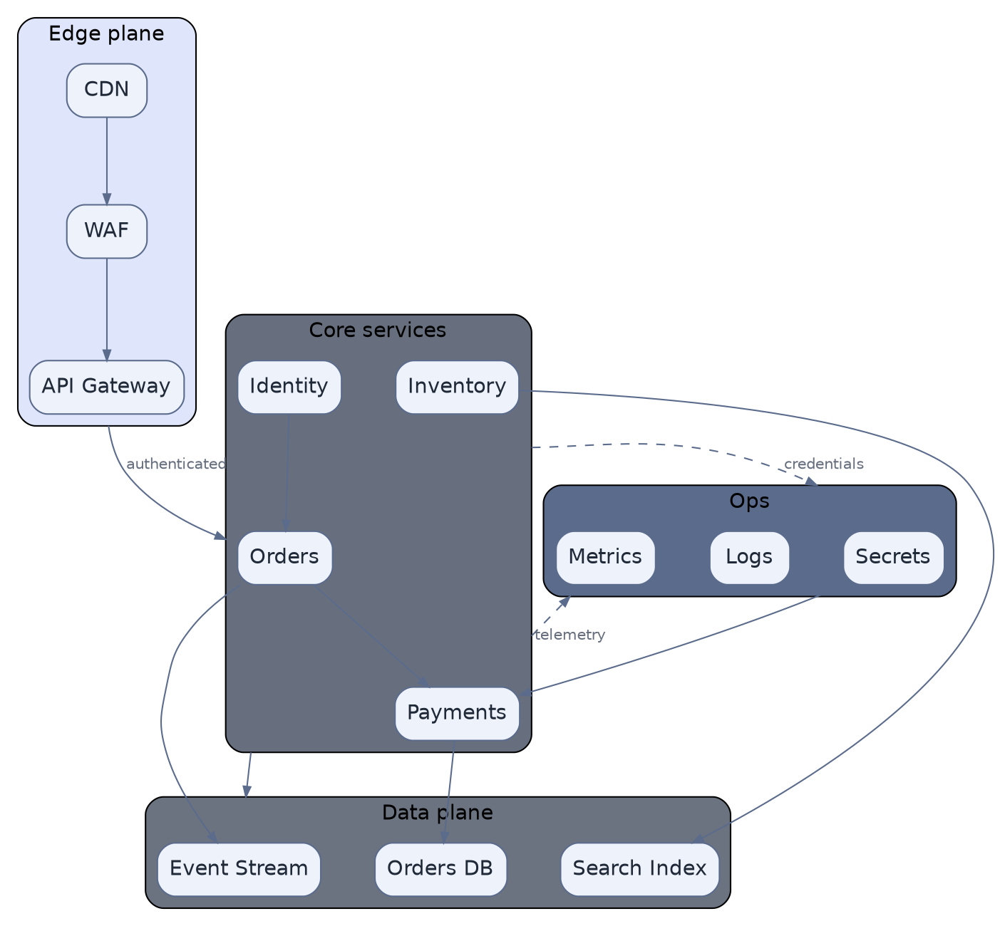

# Clustered Architecture with Cluster-to-Cluster Edges (DOT)

**Best for**: architecture overviews where edges should connect *groups* rather than individual boxes
**Avoid when**: the reader needs service icons (use a PlantUML cloud/network example)
**Answers**: how bounded contexts or planes relate, without drawing every internal edge

## Key Options

| Syntax | Effect |
|---|---|
| `compound=true` | **Required** before `lhead` / `ltail` have any effect |
| `ltail=cluster_x` / `lhead=cluster_y` | Clips the edge to the cluster boundary — the edge then reads as "plane to plane" |
| `subgraph cluster_* { style="rounded,filled"; fillcolor=… }` | Filled cluster boxes; colour by plane, not by node |
| `nodesep` / `ranksep` | Spacing between nodes in a rank / between ranks — the two knobs that fix cramped layouts |
| `graph [fontname=…]` plus per-object fonts | Keep fonts consistent across graph, nodes and edges |

## Data Shape

Clusters = **planes or bounded contexts**; internal edges = the few relationships worth showing inside a plane;
`lhead`/`ltail` edges = the cross-plane contract. Reader question: "what are the planes and how do they talk".

## Pitfalls

- ❌ Using `lhead`/`ltail` without `compound=true` → ✅ they are silently ignored; the edge will attach to the node
- ❌ Drawing every internal call → ✅ show the 1–3 edges per plane that define the plane's role
- ❌ Cross-plane edges landed on a random node → ✅ use `ltail`/`lhead` so the edge speaks about the group
- ❌ Different fill for every cluster with no meaning → ✅ three planes maximum in practice; colour *is* the grouping

## Alternatives

| Variant | Use instead |
|---|---|
| Vendor icons for cloud services | `aws-serverless-architecture.md` (plantuml + awslib or mxgraph icons) |
| Deployment/zone topology | `runtime-deployment-topology.md` |
| Dependency direction analysis | `dependency-graph.md` |

<!-- source: Graphviz `compound` + `lhead`/`ltail` attributes (dot only), verified with @viz-js/viz (Graphviz 15.1.1) -->
