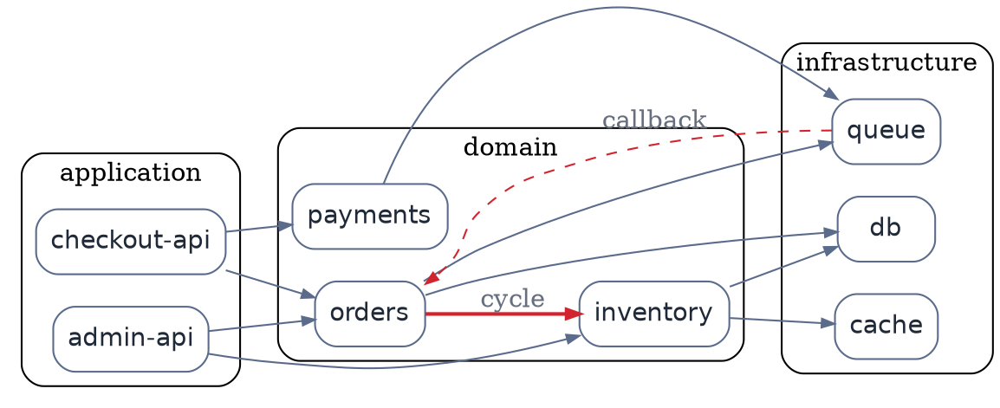

# Module Dependency Graph (DOT)

**Best for**: showing who depends on whom across modules, packages or services — and where the cycles are
**Avoid when**: you need data flow or call ordering (use a sequence diagram) or an architecture overview with icons
**Answers**: the dependency direction, the layering, and any accidental cycles

## Key Options

| Syntax | Effect |
|---|---|
| `digraph name { … }` | Directed graph — dependencies have a direction; use `graph` only for undirected relations |
| `rankdir=LR` | Left-to-right layering; use `TB` for dependency trees that read top-down |
| `subgraph cluster_<name> { … }` | **Cluster name must start with `cluster_`**, otherwise no box is drawn |
| `subgraph cluster_x { label="…"; style=rounded; }` | Cluster label and border style |
| `[color=…, penwidth=2]` | Highlight the problem edges (cycles, back-references) instead of colouring everything |
| `[style=dashed]` | Asynchronous or callback edges |

## Data Shape

A **layered digraph**: consumers on the left (or top), infrastructure on the right (or bottom). Every edge that
points "backwards" against the layering is a design finding — colour those, not the normal ones.

## Pitfalls

- ❌ `subgraph backend { }` without the `cluster_` prefix → ✅ no box is drawn; rename to `cluster_backend`
- ❌ Missing semicolons after statements → ✅ DOT tolerates some omissions, but stick to `;` for predictable output
- ❌ Colouring every node → ✅ colour only anomalies; a rainbow graph hides the finding you want to communicate
- ❌ Drawing one giant graph → ✅ split by concern if the label count exceeds ~40 nodes

## Alternatives

| Variant | Use instead |
|---|---|
| Runtime call ordering | A sequence diagram (`api-interaction-sequence.md`) |
| Physical/network relations | `network-topology-enterprise.md` |
| Unstructured relationship networks | `relationship-network-neato.md` (force-directed) |

<!-- source: Graphviz DOT attribute reference + dot gallery (directed graphs: bazel, go-package, ninja) -->
