# Causal Tree / Fishbone Analysis (DOT)

**Best for**: root-cause analysis where causes branch off a spine (the classic Ishikawa fishbone)
**Avoid when**: you need weighted or probabilistic analysis (use a table) or a solution tree rather than causes
**Answers**: which candidate causes exist for one effect, grouped by category

```dot
digraph fishbone {
  node [style=filled fillcolor="#eef2fb" color="#5b6b8c" fontcolor="#1f2937"]
  edge [color="#5b6b8c" fontcolor="#676f7e"]
  rankdir=LR;
  graph [fontname="Helvetica", ranksep=0.7, nodesep=0.25];
  node [shape=box, style="rounded,filled", fillcolor="#eef2fb", fontname="Helvetica", fontsize=11];
  edge [arrowsize=0.6];

  // the spine reads left to right, ending at the observed effect
  subgraph cluster_spine {
    style=invis;
    rank=same;
    "spine_root"; "cause_people"; "cause_process"; "cause_platform"; "cause_partners"; effect;
  }

  effect [shape=box, style="rounded,filled", fillcolor="#dfe5fb", penwidth=2, label="Effect:\nlate deliveries"];

  "spine_root" [shape=point, width=0.12, label=""];

  // bones: one node per cause category, then leaves under each
  "cause_people" [label="People"];
  "cause_process" [label="Process"];
  "cause_platform" [label="Platform"];
  "cause_partners" [label="Partners"];

  "people_1" [label="on-call rotation gaps"];
  "people_2" [label="single owner for two services"];

  "process_1" [label="manual release approval"];
  "process_2" [label="no rollback rehearsal"];

  "platform_1" [label="queue backlog at peak"];
  "platform_2" [label="cold-start latency"];

  "partners_1" [label="label printing lead time"];
  "partners_2" [label="carrier API outage"];

  // spine
  "spine_root" -> "cause_people" -> "cause_process" -> "cause_platform" -> "cause_partners" -> effect;

  // bones hang off the spine
  "people_1" -> "cause_people" [dir=back];
  "people_2" -> "cause_people" [dir=back];
  "process_1" -> "cause_process" [dir=back];
  "process_2" -> "cause_process" [dir=back];
  "platform_1" -> "cause_platform" [dir=back];
  "platform_2" -> "cause_platform" [dir=back];
  "partners_1" -> "cause_partners" [dir=back];
  "partners_2" -> "cause_partners" [dir=back];

  // highlight the root cause candidates the team agreed on
  "platform_1" [fillcolor="#6b7280", penwidth=2];
  "process_1" [fillcolor="#5b6b8c", penwidth=2];
}
```

## Key Options

| Syntax | Effect |
|---|---|
| `{ rank=same; a; b; c }` | Puts the spine nodes on one rank — without it the fishbone collapses into a tree |
| `A -> B -> C -> D` | Chain notation for the spine (shorter than one statement per edge) |
| `"leaf" -> "bone" [dir=back]` | Draws the bone attachments pointing *into* the spine (fishbone direction) |
| `shape=point` | Round marker for the spine root |
| Colour + `penwidth` on agreed causes | Highlight the shortlisted root causes instead of colouring everything |
| `subgraph cluster_spine { style=invis; … }` | Groups the spine for `rank=same` without drawing a box |

## Data Shape

One effect, 4–6 cause categories, 2–4 causes each. The diagram is for **hypothesis generation**: after the
discussion, highlight the shortlisted causes (colour) so the diagram becomes a record of the analysis.

## Pitfalls

- ❌ Building it as a plain tree → ✅ a fishbone needs `rank=same` on the spine, otherwise it reads as a hierarchy
- ❌ More than six categories → ✅ six is the practical limit; merge or drop
- ❌ Causes stated as solutions ("add more servers") → ✅ keep causes descriptive; solutions belong in a separate list
- ❌ No prioritisation → ✅ highlight the agreed candidates, otherwise the exercise has no output

## Alternatives

| Variant | Use instead |
|---|---|
| Weighted/prioritised causes | A GFM table or a risk register card |
| Decision tree with outcomes | A `dot` decision tree with labelled edges |
| Process flow with responsible roles | `approval-workflow-swimlane.md` |

<!-- source: DOT rank/rankdir semantics; replaces the unsupported mermaid ishikawa scenario (see plans/skills-restructure-plan.md §4.3.1) -->
