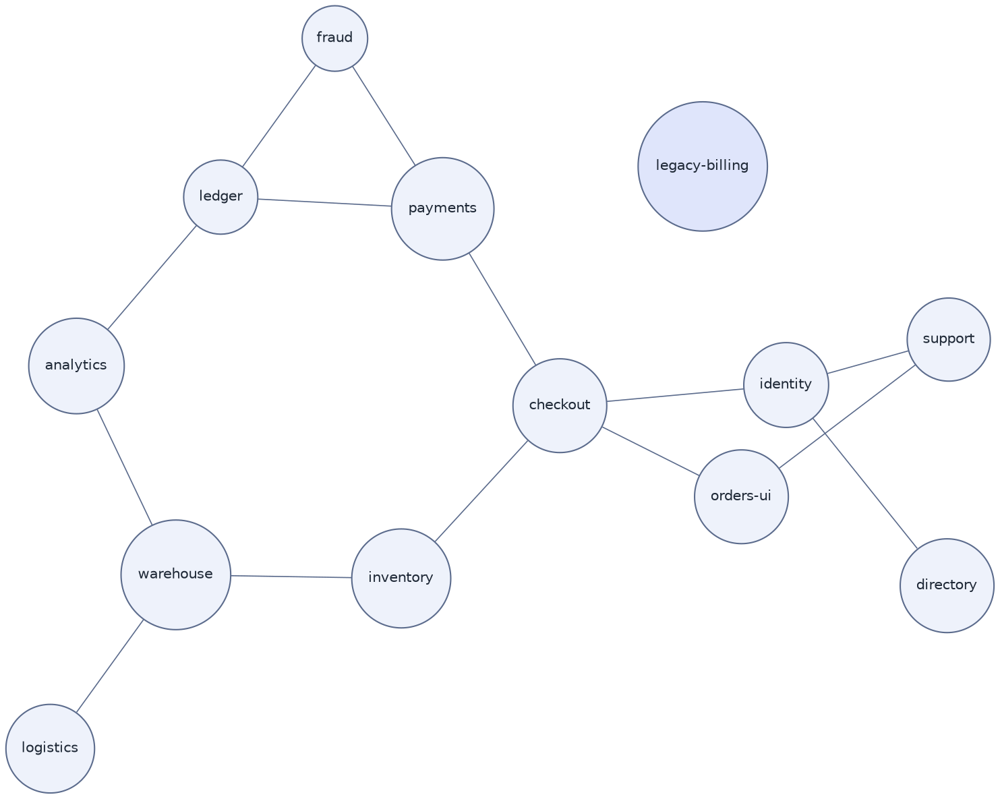

# Relationship Network (DOT, force-directed layout)

**Best for**: unstructured relations — service mesh dependencies, knowledge/entity graphs, correlational groupings
**Avoid when**: the relations are hierarchical or layered (use the default `dot` layout)
**Answers**: which nodes cluster together, which are central, and which are isolated

## Key Options

| Syntax | Effect |
|---|---|
| `layout=neato` | Force-directed layout (stress majorization); `fdp`/`sfdp` are related engines for larger graphs |
| `overlap=false` | Removes node overlaps — required for readable force layouts |
| `splines=true` | Curved edges that avoid nodes; with `splines=line` edges are straight segments |
| `weight=N` | Higher weight pulls nodes closer and straightens the edge — use it to express *strength*, not just existence |
| `len=…` | Preferred edge length (neato/fdp) — express "these should be far apart" |
| `sep="+8"` | Minimum separation between node boundaries (additive form) |
| `graph ... _` | `graph` instead of `digraph`: relations here are symmetric; use `digraph` only when direction matters |

## Data Shape

Nodes + weighted undirected edges. In a force layout, **distance is the message**: clusters, hubs and outliers
become visible without any explicit grouping.

## Pitfalls

- ❌ Expecting a deterministic layout → ✅ force layouts are seed-dependent; keep `start=` unset for reproducibility across runs of the same version, and do not hand-tune positions
- ❌ Heavy graphs with no `weight` → ✅ every edge looks equal and no cluster appears; weight the strong ties
- ❌ Reading direction into edges → ✅ use `graph`/`--` when relations are symmetric, otherwise readers assume a flow
- ❌ Using neato for hierarchical data → ✅ layers and ranks are the `dot` engine's job; switching layout is one line (`layout=dot`)

## Alternatives

| Variant | Use instead |
|---|---|
| Hierarchical dependencies | `dependency-graph.md` (`digraph`, default dot layout) |
| Hub-and-spoke centre | `radial-hub-network.md` (`layout=twopi`) |
| Graph with role-based icons | plantuml examples (network/cloud icon families) |

<!-- source: Graphviz layouts (neato/fdp/sfdp) and attributes overlap/sep/weight/len; layout selection verified with @viz-js/viz 3.29 -->
