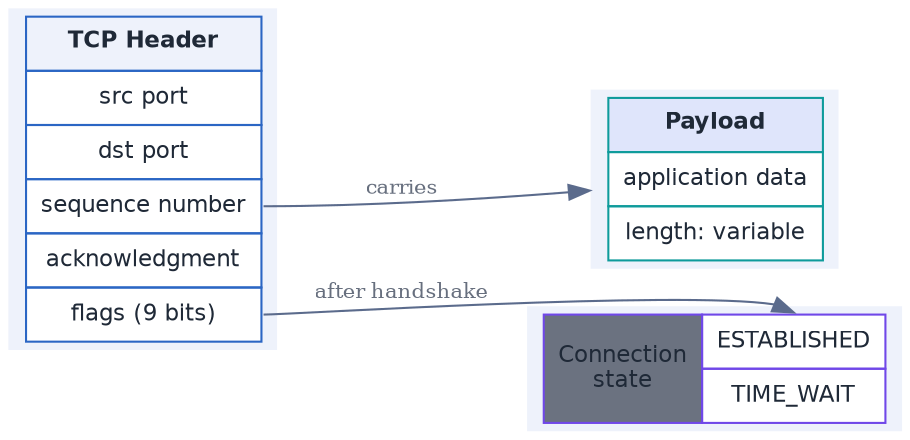

# Data Structure / Table Nodes (DOT, HTML-like labels)

**Best for**: showing structure *inside* nodes — records, structs, memory layouts, request/response schemas
**Avoid when**: plain boxes are enough (use a dependency graph) or you need an ER diagram with cardinalities
**Answers**: what each node contains, field by field, and where the links attach

## Key Options

| Syntax | Effect |
|---|---|
| `label=< … >` | **HTML-like label** (angle brackets, not quotes) — the label is parsed as a mini-HTML table |
| `shape=plaintext` / `shape=plain` | `plain` = `none` + `width=0 height=0 margin=0`, so the node is exactly the table |
| `<TABLE BORDER CELLBORDER CELLSPACING CELLPADDING>` | Table borders, cell borders, spacing and padding — the same names as HTML |
| `<TD BGCOLOR="…" ALIGN="…" VALIGN="…" COLSPAN="…" ROWSPAN="…">` | Per-cell styling and spanning |
| `<TD PORT="name">` + `node:port -> …` | Connect an edge to a specific cell |
| `<B> <I> <U>   ` | Inline formatting (available with the SVG renderer) |

## Data Shape

Each node is a small table; edges attach to **ports**. This is the only way in DOT to express "field-level" or
"cell-level" connections — which is why it is worth the verbosity.

## Pitfalls

- ❌ Quoting the label (`label="<TABLE>…"`) → ✅ HTML labels need `label=< … >` without quotes
- ❌ Raw `&`, `<`, `>` inside cell text → ✅ escape as `&amp;`, `&lt;`, `&gt;`
- ❌ Wrapping the table in ``/`<B>` with a leading space → ✅ that is a documented syntax error
- ❌ Forgetting `margin=0` → ✅ with `shape=plain`, edges stop being clipped to an invisible box

## Alternatives

| Variant | Use instead |
|---|---|
| Plain boxes and arrows | `dependency-graph.md` |
| Record syntax shorthand | `shape=record label="<f0>a|<f1>b"` (simpler, fewer styling options) |
| Entity relationships with cardinality | `entity-relationships-crows-foot.md` (plantuml IE) |

<!-- source: Graphviz node shapes documentation (record-based and HTML-like labels), verified with @viz-js/viz 3.29 (Graphviz 15.1.1) -->
