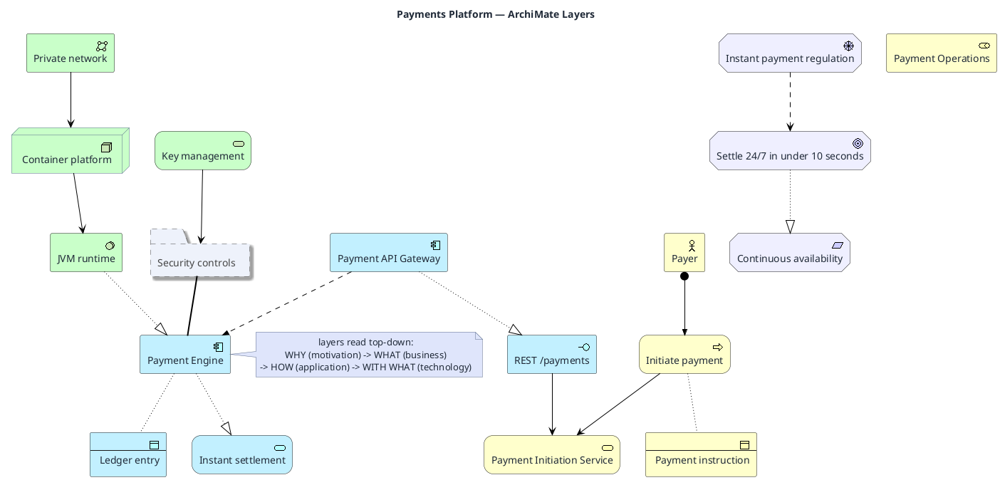

# ArchiMate Layered Model

**Best for**: enterprise architecture where business, application and technology layers must be shown together
**Avoid when**: the audience only needs one system (use a component or cloud example)
**Answers**: which business services exist, which applications realise them, and which technology supports those

## Key Options

| Syntax | Effect |
|---|---|
| `!include <archimate/Archimate>` | Loads the ArchiMate stdlib macros (**required** before any macro call) |
| `Business_*` / `Application_*` / `Technology_*` | Layer element macros — elements: `_Actor` `_Role` `_Service` `_Process` `_Component` `_Interface` `_Function` `_Event` `_Object` `_Node` `_Device` `_SystemSoftware` `_CommunicationNetwork` |
| `Motivation_*` / `Strategy_*` / `Implementation_*` | Why-layer and transformation elements (`_Driver` `_Goal` `_Requirement` `_Capability` `_ValueStream` `_WorkPackage` `_Deliverable` `_Plateau` `_Gap`) |
| `Rel_*` | Relationships: `Rel_Serving` `Rel_Realization` `Rel_Access` `Rel_Flow` `Rel_Composition` `Rel_Aggregation` `Rel_Assignment` `Rel_Triggering` `Rel_Specialization` `Rel_Association` `Rel_Influence` |
| `Grouping(alias, "Name")` | ArchiMate grouping (use for cross-cutting concerns) |
| Layer order | Draw motivation on top, business → application → technology downward; the nesting *is* the model |

## Data Shape

Four layers of nodes plus relationship edges. Every application element should realise exactly one business service
(via `Rel_Serving`), and every technology element should serve an application element — gaps in those chains are the
findings an EA review looks for.

## Pitfalls

- ❌ Forgetting `!include <archimate/Archimate>` → ✅ nothing renders correctly without it
- ❌ Using `-->` for ArchiMate relationships → ✅ use `Rel_*`: the relationship *type* carries the meaning
- ❌ Putting every element in one flat line → ✅ group by layer (rectangles or ordering) so the model reads as a stack
- ❌ Modelling the org chart instead of capabilities → ✅ ArchiMate is about services and realisation, not reporting lines

## Alternatives

| Variant | Use instead |
|---|---|
| Capability heat map / value stream only | `capability-map.md` |
| Solution architecture with cloud icons | `aws-serverless-architecture.md` |
| Migration planning (plateaus, gaps, work packages) | Same macros with `Implementation_*` + `Rel_Triggering` |

<!-- source: draw-uml archimate macro parser (L1, 11 fixtures; macros verified against parsers/archimate-macros.ts) -->
