# Capability Map and Value Stream

**Best for**: business/IT alignment conversations — which capabilities exist, which value streams use them, who owns them
**Avoid when**: the audience needs the technical realisation (use the ArchiMate layered model)
**Answers**: what the business *can do* (capabilities), how value flows through them, and where the gaps are

```plantuml
@startuml
skinparam DefaultFontColor #1f2937
skinparam ArrowColor #5b6b8c
skinparam ArrowFontColor #1f2937
skinparam RectangleBackgroundColor #eef2fb
skinparam RectangleBorderColor #5b6b8c
skinparam RectangleFontColor #1f2937
skinparam ComponentBackgroundColor #eef2fb
skinparam ComponentBorderColor #5b6b8c
skinparam ComponentFontColor #1f2937
skinparam ClassBackgroundColor #eef2fb
skinparam ClassBorderColor #5b6b8c
skinparam ClassFontColor #1f2937
skinparam UsecaseBackgroundColor #eef2fb
skinparam UsecaseBorderColor #5b6b8c
skinparam UsecaseFontColor #1f2937
skinparam DatabaseBackgroundColor #eef2fb
skinparam DatabaseBorderColor #5b6b8c
skinparam DatabaseFontColor #1f2937
skinparam NodeBackgroundColor #eef2fb
skinparam NodeBorderColor #5b6b8c
skinparam NodeFontColor #1f2937
skinparam ActorBackgroundColor #eef2fb
skinparam ActorBorderColor #5b6b8c
skinparam ActorFontColor #1f2937
skinparam StateBackgroundColor #eef2fb
skinparam StateBorderColor #5b6b8c
skinparam StateFontColor #1f2937
skinparam ArtifactBackgroundColor #eef2fb
skinparam ArtifactBorderColor #5b6b8c
skinparam ArtifactFontColor #1f2937
skinparam CloudBackgroundColor #eef2fb
skinparam CloudBorderColor #5b6b8c
skinparam CloudFontColor #1f2937
skinparam FolderBackgroundColor #eef2fb
skinparam FolderBorderColor #5b6b8c
skinparam FolderFontColor #1f2937
skinparam PackageBackgroundColor #eef2fb
skinparam PackageBorderColor #5b6b8c
skinparam NoteBackgroundColor #dfe5fb
skinparam NoteBorderColor #5b6b8c
skinparam NoteFontColor #1f2937
skinparam stereotypeABackgroundColor #d9e3f4
skinparam stereotypeABorderColor #5b6b8c
skinparam stereotypeCBackgroundColor #d9e3f4
skinparam stereotypeCBorderColor #5b6b8c
skinparam stereotypeEBackgroundColor #d9e3f4
skinparam stereotypeEBorderColor #5b6b8c
skinparam stereotypeIBackgroundColor #d9e3f4
skinparam stereotypeIBorderColor #5b6b8c
!include <archimate/Archimate>
title Retail Bank — Capability Map and Value Stream

' ── Value stream (the journey) ──
Strategy_ValueStream(onboard, "Customer onboarding")
Strategy_ValueStream(service, "Daily banking service")
Strategy_ValueStream(advise, "Advisory and lending")

' ── Capabilities (what the bank can do) ──
Strategy_Capability(identity, "Identity & KYC")
Strategy_Capability(accountMgmt, "Account management")
Strategy_Capability(payments, "Payments execution")
Strategy_Capability(fraud, "Fraud detection")
Strategy_Capability(crm, "Relationship management")
Strategy_Capability(credit, "Credit assessment")
Strategy_Capability(dataGov, "Data governance")

' ── Resources behind capabilities ──
Strategy_Resource(docs, "Document processing")
Strategy_Resource(ruleEngine, "Rules engine")
Strategy_Resource(models, "Risk models")
Strategy_Resource(core, "Core banking platform")

' ── Capabilities serve value streams ──
Rel_Serving(identity, onboard)
Rel_Serving(accountMgmt, onboard)
Rel_Serving(crm, onboard)
Rel_Serving(accountMgmt, service)
Rel_Serving(payments, service)
Rel_Serving(fraud, service)
Rel_Serving(credit, advise)
Rel_Serving(crm, advise)

' ── Resources realise capabilities ──
Rel_Realization(docs, identity)
Rel_Realization(ruleEngine, fraud)
Rel_Realization(models, credit)
Rel_Realization(core, accountMgmt)
Rel_Realization(core, payments)
Rel_Realization(dataGov, dataGov)

' ── Ownership ──
Business_Role(coo, "Chief Operating Officer")
Business_Role(cro, "Chief Risk Officer")
Rel_Assignment(coo, accountMgmt)
Rel_Assignment(coo, payments)
Rel_Assignment(cro, fraud)
Rel_Assignment(cro, credit)

note bottom of dataGov
  capability with no value stream yet:
  candidate for investment or retirement
end note
@enduml
```

## Key Options

| Syntax | Effect |
|---|---|
| `Strategy_Capability(alias, "Name")` | Capability element (the "what we can do" layer) |
| `Strategy_ValueStream(alias, "Name")` | Value stream (end-to-end customer journey) |
| `Strategy_Resource(alias, "Name")` | Resource that realises a capability |
| `Business_Role(alias, "Name")` | Owner — gives the map accountability |
| `Rel_Serving` / `Rel_Realization` / `Rel_Assignment` | Capability→stream, resource→capability, owner→capability |
| Layout hint | With many nodes, keep value streams vertically aligned and capabilities below them |

## Data Shape

Three horizontal bands: **value streams → capabilities → resources**, plus owners attached to capabilities.
Gaps (capabilities not serving any stream, streams without capabilities) are the reason this diagram exists —
annotate them.

## Pitfalls

- ❌ Capabilities named after departments → ✅ name them after what the business can do (`Fraud detection`, not `Risk Dept`)
- ❌ Too many capabilities → ✅ 7 ± 2 per view; more means you need a second-level map
- ❌ No ownership → ✅ attach at least an owner per capability, or reviewers cannot act on the map
- ❌ Hiding gaps → ✅ a capability with no stream, or a stream with no capability, should be visually obvious

## Alternatives

| Variant | Use instead |
|---|---|
| Full layered EA model | `archimate-layered-model.md` |
| Capability maturity / heat view | An infocard matrix or quadrant template |
| Process-level detail for one stream | `approval-workflow-swimlane.md` |

<!-- source: Strategy_* / Business_* / Rel_* macros verified in draw-uml parsers/archimate-macros.ts -->
