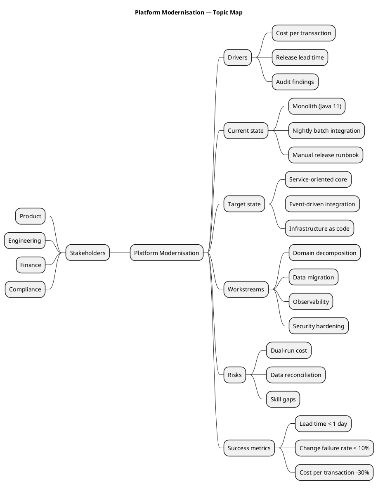

# Topic Mind Map

**Best for**: decomposing one topic into branches when there is no strict order or hierarchy layer
**Avoid when**: the structure is a real org chart or a work breakdown with owners (use WBS) or the nodes need free positioning (use a canvas-style layout)
**Answers**: what the topic consists of, at a glance

## Key Options

| Syntax | Effect |
|---|---|
| `@startmindmap` … `@endmindmap` | Mind map mode (independent from `@startuml`) |
| `*` / `**` / `***` | Depth levels — indentation is expressed by asterisk count, not spaces |
| `left side` | Everything after it is placed on the left branch (visual balance / compare two halves) |
| `*: multi-line` | Multi-line rich-text node when a single word is not enough |
| `title` | Diagram title |

## Data Shape

A tree with 4–7 top-level branches and 2–4 children each. More than that and the map stops being scannable —
split it into two maps (current state / target state).

## Pitfalls

- ❌ Every branch at a different depth → ✅ keep sibling depth consistent; uneven trees read as unfinished
- ❌ Sentences in nodes → ✅ node text is a noun phrase; put explanation in the prose around the diagram
- ❌ Using a mind map for a process → ✅ mind maps have no order; use an activity diagram when sequence matters
- ❌ Forgetting `left side` → ✅ for 5+ top branches, split them left/right instead of a tall one-sided tree

## Alternatives

| Variant | Use instead |
|---|---|
| Work breakdown with owners and deliverables | `work-breakdown-structure.md` |
| Concept relationships with cross-links | A `dot` graph (`dependencies-and-relations`) |
| Ordered progression of stages | An infographic sequence template or `sequence-*` |

<!-- source: draw-uml mindmap parser (L1, 27 fixtures) -->
