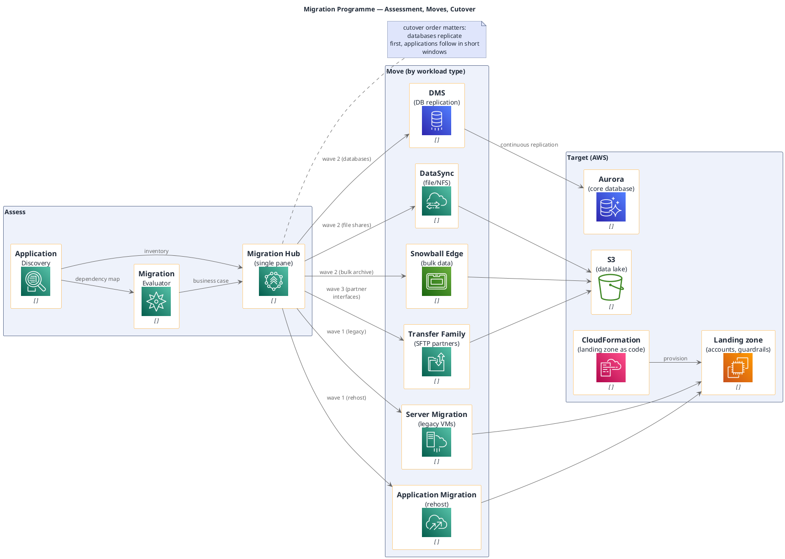

# Cloud Migration Programme (AWS, portable icons)

**Best for**: migration planning — what moves, in which wave, and with which tool
**Avoid when**: the reader needs the target architecture (use a cloud architecture example) or a dated schedule (use a Gantt)
**Answers**: which workloads migrate with which mechanism, and where the blockers are

## Key Options

| Syntax | Effect |
|---|---|
| `!include <awslib/MigrationTransfer/all.puml>` | `MigrationHub`, `MigrationHubRefactorSpaces*`, `ApplicationDiscoveryService`, `ApplicationMigrationService`, `ServerMigrationService`, `MigrationEvaluator`, `DataSync`, `TransferFamily*`, `MainframeModernization*` |
| `!include <awslib/Storage/all.puml>` | `Snowball`, `SnowballEdge`, `StorageGateway*`, S3 family |
| `!include <awslib/Database/all.puml>` | `DatabaseMigrationService`, `Aurora*`, `DynamoDB` |
| `rectangle "Assess" { … }` | Grouping by **phase** (assess / move / target) instead of by service family |
| Edge labels | Put the wave (`wave 1`) on the edge — that is the migration plan in one word |

## Data Shape

Three bands — **assess → move → target** — with the move band split by mechanism (rehost / database / data / partner
interface). Every mechanism edge should end at a concrete target resource, otherwise the plan has nowhere to land.

## Pitfalls

- ❌ Nothing about assessment → ✅ discovery + evaluator are what justify the move; start the diagram there
- ❌ A single "migrate" arrow → ✅ split by mechanism; each has different cutover behaviour and downtime
- ❌ Bulk data on the network path → ✅ use Snowball for large archives; showing it prevents an unrealistic estimate
- ❌ Ignoring partner interfaces → ✅ SFTP/AS2 partners need their own migration path (Transfer Family)

## Alternatives

| Variant | Use instead |
|---|---|
| Migration plan with dates and owners | `release-gantt-plan.md` or a programme WBS |
| Target-state architecture | Cloud architecture examples (`awslib` or `mxgraph.aws4`) |
| Application-level dependency analysis | A dependency graph in `dot` |

<!-- source: draw-uml-dev fixtures/plantuml/stdlib/aws/028 (MigrationTransfer) + 034/035 (Storage) + 012 (Database) macro lists -->
