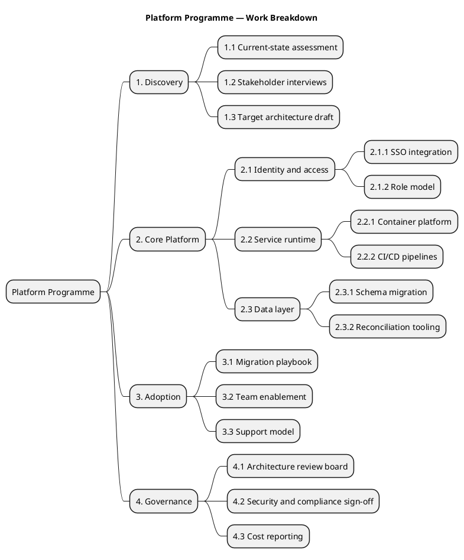
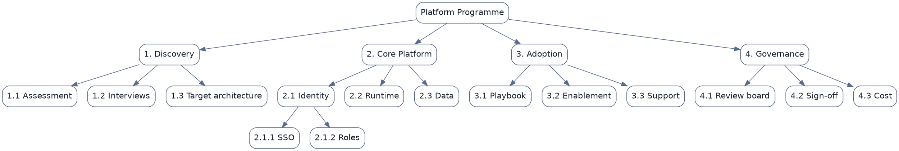

# Work Breakdown Structure (engine gap — use the alternatives below)

**Best for**: deliverables and ownership in a strict hierarchy — **but not with `@startwbs` in this engine**
**Avoid when**: you need free-form idea exploration (use `topic-mindmap.md`)
**Answers**: what the work is made of and who owns each part

> ⚠️ **Engine limitation (verified 2026-09-21)**: `@startwbs … @endwbs` **parses without error but renders an empty
> diagram**. Use one of the two supported forms below instead.

## Option A — hierarchy as a mind map (recommended)

## Option B — hierarchy as a Graphviz tree (when you need boxed, top-down layout)

## Key Options

| Syntax | Where it applies | Effect |
|---|---|---|
| `*` / `**` / `***` / `****` | mind map | Depth levels — indentation is expressed by asterisk count, not spaces |
| `left side` | mind map | Move the following branches to the left half |
| `rankdir=TB` + `->` chains | Graphviz | Top-down tree |
| `node [shape=box, style=rounded]` | Graphviz | Boxed nodes read as deliverables rather than concepts |
| WBS numbering in the text | both | Number the nodes (`2.1.1`) so reviews can cite them |

## Data Shape

A pure tree, 3–4 levels deep. Each leaf should be a deliverable someone can own; if a leaf is an activity, the
structure has drifted from WBS into a project plan.

## Pitfalls

- ❌ Writing `@startwbs` → ✅ it renders empty in this engine; use Option A or B above
- ❌ Leaves that are activities ("run tests") → ✅ leaves are deliverables/artefacts
- ❌ Unnumbered nodes → ✅ WBS numbering is what makes the structure citable in plans and reviews
- ❌ More than four levels → ✅ deeper than four means it belongs in a separate sub-structure

## Alternatives

| Variant | Use instead |
|---|---|
| Org chart with team names | Option B (Graphviz tree), or a mind map using `left side` |
| Free-form topic decomposition | `topic-mindmap.md` |
| Dated plan | `release-gantt-plan.md` |

<!-- source: gap verified via documd (342 B blank SVG), confirmed by draw-uml-dev fixtures/svg-generated/creole/036.svg (342 B) vs official baseline (4535 B) -->

