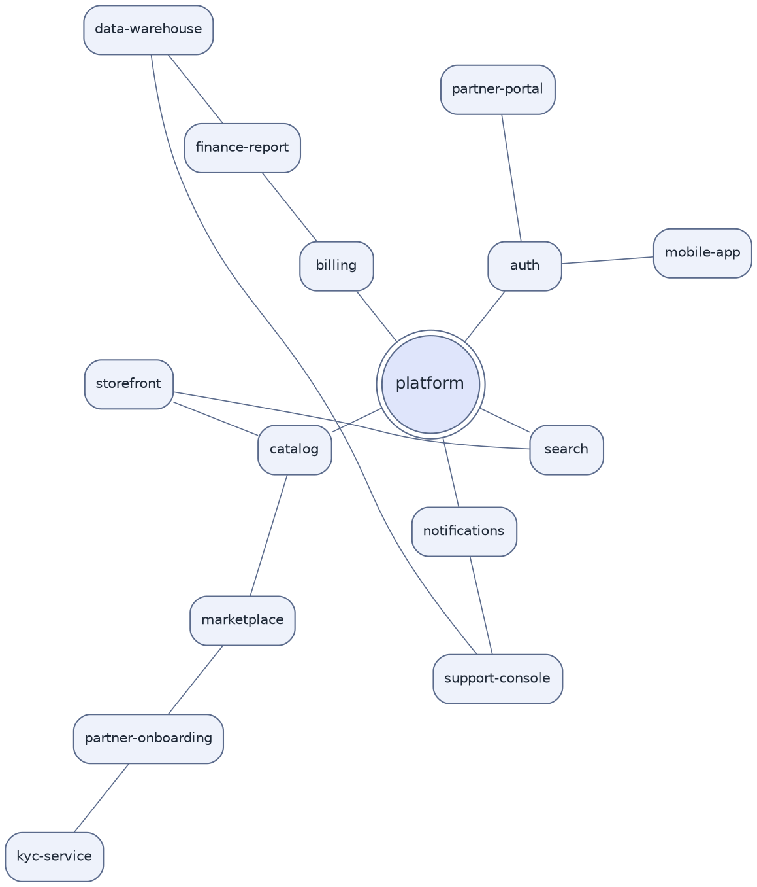

# Radial Hub Network (DOT, twopi layout)

**Best for**: one central node with rings of satellites — platform ecosystem, root-cause radius, network maps
**Avoid when**: there are several equally-important hubs (use a force layout) or strict hierarchy matters
**Answers**: what orbits the centre, and at what distance (i.e. how directly it relates)

## Key Options

| Syntax | Effect |
|---|---|
| `layout=twopi` | Radial layout — the engine arranges nodes on concentric circles |
| `root="node"` | The hub; without it twopi picks a central node itself |
| `ranksep="2.0 equally"` | Radial separation between rings (`equally` keeps rings evenly spaced) |
| `graph` + `--` | Undirected relations read better radially; direction is usually not the point here |
| `shape=doublecircle` on the hub | Visual anchor so the centre is obvious at a glance |

## Data Shape

One hub, then rings of increasing distance: direct integrations at ring 1, consumers at ring 2, supporting systems
at ring 3. The reader question is "what is close to the platform and what is peripheral".

## Pitfalls

- ❌ Several hubs in one twopi diagram → ✅ pick one root; multiple hubs need `layout=neato`
- ❌ Long chains placed radially → ✅ twopi is for *radius*, not sequences; long chains overlap the rings
- ❌ Leaving `root` unset with an ambiguous graph → ✅ the chosen centre may surprise you; always set it explicitly
- ❌ Assuming the same layout works for directed flow → ✅ if flow direction matters, `dot` with `rankdir` is clearer

## Alternatives

| Variant | Use instead |
|---|---|
| Multiple hubs, emergent clusters | `relationship-network-neato.md` |
| Strict hierarchy / org chart | Default `dot` layout with `rankdir=TB` |
| Ecosystem map with brand icons | plantuml cloud icon families (`mxgraph.aws4`, `awslib`) |

<!-- source: Graphviz twopi layout attributes (root, ranksep); layout=twopi verified with @viz-js/viz 3.29 -->
