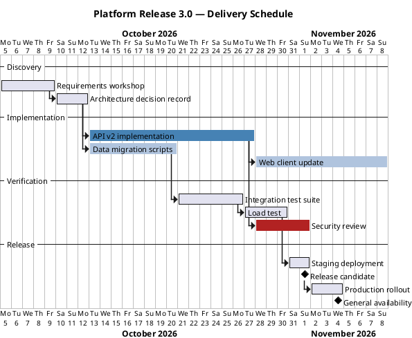

# Release Plan (Gantt)

**Best for**: dated schedules with dependencies — phases, parallel tracks, milestones and owners
**Avoid when**: you only need a sequence of steps without dates (use an activity diagram) or a marketing-style roadmap (use an infographic timeline)
**Answers**: when each workstream runs, what blocks what, and when the milestones land

## Key Options

| Syntax | Effect |
|---|---|
| `Project starts 2026-10-05` | Sets the calendar origin (otherwise only relative days exist) |
| `[Task] requires 15 days` | Duration (`N days`, `N weeks`, `N weeks and M days`) |
| `[Task] starts at [Other]'s end` | Dependency — the backbone of a useful Gantt |
| `[Task] starts D+3` | Relative start offset from project start |
| `[Milestone] happens at [Task]'s end` | Zero-duration milestone |
| `[Task] is colored in SteelBlue` | Colour a bar; colour by *track* (implementation / verification / release), not by taste |
| `-- Section --` | Visual separator between phases |

## Data Shape

Tasks with durations + dependency edges, grouped into phases by separators. Colour carries the track/owner so the
reader can answer "who is on the critical path".

## Pitfalls

- ❌ Durations without dependencies → ✅ the dependency edges are what makes a Gantt more than a table
- ❌ Hiding verification work → ✅ tests and security reviews are tasks; omitting them is a silent schedule lie
- ❌ Colour per task → ✅ colour per track; rainbow Gantts lose the critical path
- ❌ No milestones → ✅ a release without an explicit `happens at` date has no commitment

## Alternatives

| Variant | Use instead |
|---|---|
| Audience is external / no dates yet | Infographic timeline or roadmap template (`planning-and-roadmap`) |
| Process with owners, no dates | `approval-workflow-swimlane.md` |
| Milestone list only | A card / list template with badge items |

<!-- source: draw-uml gantt parser (L1, 111 fixtures); syntax verified against fixtures 001/009/010/011 -->
