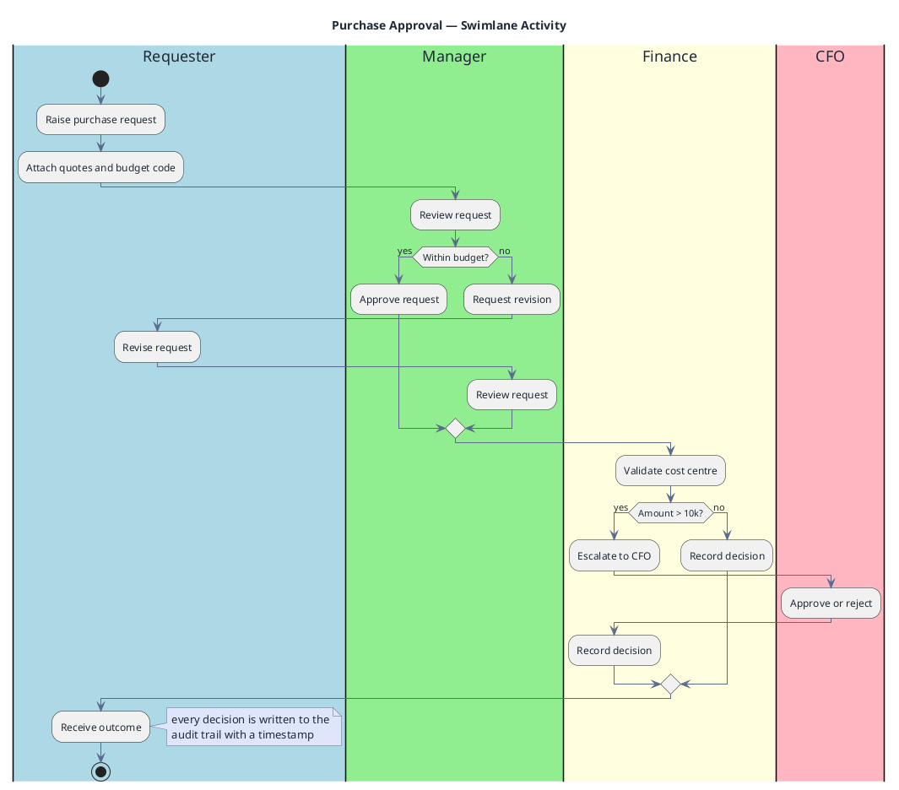

# Approval Workflow (Swimlane Activity)

**Best for**: cross-role business processes where you must see *who* does *what* and where hand-offs happen
**Avoid when**: the process is single-role (a plain activity diagram is simpler) or message-based (use EIP)
**Answers**: the steps, the responsible role for each, and the decision points that branch the flow

## Key Options

| Syntax | Effect |
|---|---|
| `\|Role\|` | Start a lane; subsequent `:step;` statements belong to it |
| `\|#LightBlue\|Role\|` | Coloured lane header — colour the **role**, not the step |
| `start` / `stop` | Explicit begin and end markers |
| `if (cond?) then (yes)` / `else (no)` / `endif` | Decision with both branches labelled |
| `\|Role\|` in the middle of a branch | Hand-off — the reader literally sees the work change hands |
| `note right` … `end note` | **Activity diagrams attach notes to the previous step** — `note right of <name>` is rejected by PlantUML here; use `note right` or `floating note right: …` instead |

## Data Shape

Sequential steps partitioned by **actor**. Branches must return to a lane before handing off, otherwise the lane
structure becomes ambiguous in the rendered diagram.

## Pitfalls

- ❌ Lanes named after systems instead of roles → ✅ lanes are *responsibility*; systems belong in a component diagram
- ❌ Branching without returning to a lane → ✅ always re-enter a lane after `else` so the hand-off is explicit
- ❌ Encoding every rule in the diagram → ✅ keep policies in a note; diagrams show flow, not the rulebook
- ❌ Unlabelled decision outcomes → ✅ `then (yes)` / `else (no)` — never leave a branch anonymous
- ❌ `note right of <lane-or-step-name>` → ✅ not valid in activity/swimlane diagrams (PlantUML errors); use `note right` after the step, or `floating note right: …`

## Alternatives

| Variant | Use instead |
|---|---|
| Single-role procedure | Activity diagram without lanes |
| BPMN-compliant notation with events/gateways | `mxgraph.bpmn.*` icons + activity diagram |
| System-to-system orchestration | `eip-message-flow.md` or a sequence diagram |

<!-- source: draw-uml L1 `activity-diagram-lane` fixtures (13 cases) -->
