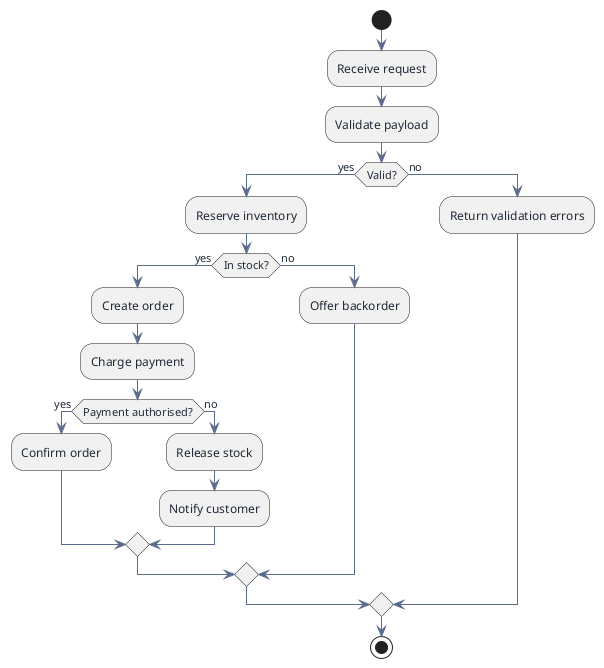

# Activity Flow — A Process With Decisions (PlantUML)

**Best for**: the plainest process diagram: ordered steps, one or two decisions, and the paths they create
**Avoid when**: the process has roles to separate (use the swimlane variant) or it is a message exchange (sequence)
**Answers**: what happens next, and what happens when a check fails

## Data Shape

Linear statements with `:` … `;` are actions; `if (…) then (…) / else (…) / endif` is a decision. `start` and
`stop` are explicit — an activity diagram with no end state invites "and then what?".

## Key Options

| Option | Effect |
|---|---|
| `if/else/endif` | The only decision construct; nest them to express a real branch tree |
| `repeat` / `while` | Loops, with `repeat while (…) is (yes)` for the exit condition |
| `fork` / `fork again` / `end fork` | Parallel work, joined before continuing |
| `swimlane` per role | Move to the lane variant when *who does it* matters |
| `:action;` with `<<stereotype>>` | Marks automated vs manual steps |

## Pitfalls

- ❌ A diagram with twenty actions → ✅ split at the first major decision; readers lose the thread after ~12 nodes
- ❌ Decisions whose else branch is "end" → ✅ name the failure path, it is usually the interesting one
- ❌ Drawing responsibilities without lanes → ✅ if the reader will ask "who does this?", switch to the swimlane variant
- ❌ No start or stop → ✅ every activity diagram needs both, or it reads as a fragment

## Alternatives

| Variant | Use instead |
|---|---|
| Roles in columns | `approval-workflow-swimlane.md` |
| Message exchange over time | `api-interaction-sequence.md` (software-design) |
| A straight path with owners and no branches | `procurement-approval-path.md` (infographic) |

<!-- source: PlantUML activity diagram (beta) reference + draw-uml fixture corpus (activity-diagram, 56 cases) -->
