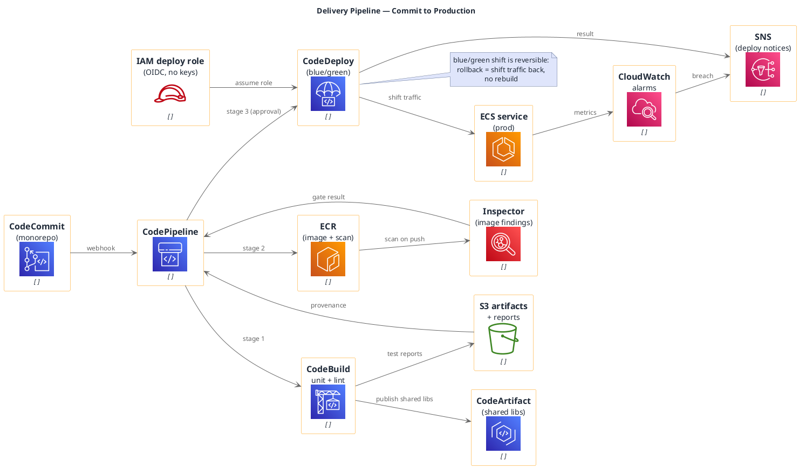

# CI/CD Pipeline (AWS Developer Tools)

**Best for**: platform/DevOps audiences — how a commit becomes a running container in production
**Avoid when**: the process spans multiple vendors or includes manual approvals as the main topic (use a swimlane activity)
**Answers**: the stages a change passes through, what gates it, and where artifacts are stored

## Key Options

| Syntax | Effect |
|---|---|
| `!include <awslib/DeveloperTools/all.puml>` | `CodeCommit`, `CodeBuild`, `CodeDeploy`, `CodePipeline`, `CodeArtifact`, `CodeStar` |
| `!include <awslib/ApplicationIntegration/all.puml>` | Required for `SimpleNotificationService(...)` / `SimpleQueueService(...)` style messaging macros |
| `!include <awslib/SecurityIdentityCompliance/all.puml>` | `IdentityAccessManagementRole`, `Inspector`, `KeyManagementService`, `SecretsManager` |
| `!include <awslib/Compute/all.puml>` | `Lambda`, `EC2*`, `AutoScalingGroup`, `Batch` |
| Portable | awslib is official PlantUML stdlib — this diagram works outside Markdown Viewer too |
| `note right of X` outside activity diagrams | Valid here (node-edge diagram); inside activity/swimlane diagrams use `note right` instead |

## Data Shape

A left-to-right chain with **gates**: source → build → artifact store → image registry → security scan →
deploy → runtime, plus an observability branch. Gaps between stages are the approvals.

## Pitfalls

- ❌ Drawing only the happy path → ✅ a pipeline diagram without the security gate and rollback story is misleading
- ❌ Long-lived credentials → ✅ model the deploy role/identity as an explicit node; it explains the trust model
- ❌ One giant "build & deploy" box → ✅ separate build, scan and deploy so failures have a visible location
- ❌ Forgetting a category include → ✅ `SimpleNotificationService(...)` belongs to `ApplicationIntegration/all.puml`
- ❌ Forgetting artifact provenance → ✅ connect the artifact store to the pipeline; auditors ask for it

## Alternatives

| Variant | Use instead |
|---|---|
| Process view with approvers and hand-offs | `approval-workflow-swimlane.md` |
| Runtime topology after deploy | `runtime-deployment-topology.md` |
| Multi-environment promotion matrix | A GFM table or an infocard matrix card |

<!-- source: draw-uml-dev fixtures/plantuml/stdlib/aws/014 (DeveloperTools) + 010/032/035 macro lists (names verified verbatim) -->
