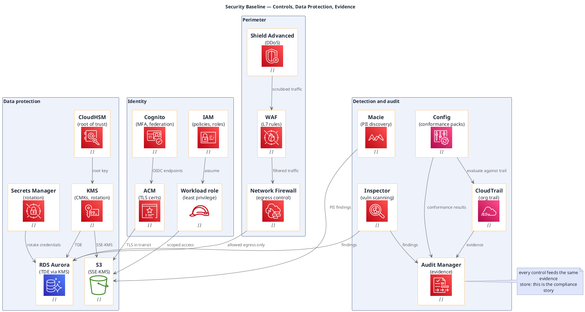

# Security Baseline (AWS, portable icons)

**Best for**: compliance and security reviews — identity, encryption, detection and audit in one picture
**Avoid when**: the audience wants attack paths (use a threat model) or the runtime topology
**Answers**: which controls protect which resource, and what produces audit evidence

## Key Options

| Syntax | Effect |
|---|---|
| `!include <awslib/SecurityIdentityCompliance/all.puml>` | `IdentityandAccessManagement`, `IdentityAccessManagementRole`, `KeyManagementService`, `CloudHSM`, `SecretsManager`, `CertificateManager`, `Inspector`, `Macie`, `WAF`, `Shield`, `NetworkFirewall`, `AuditManager`, `Cognito` |
| `!include <awslib/ManagementGovernance/all.puml>` | `CloudTrail`, `Config`, `CloudFormation*`, `CloudWatch*` |
| `rectangle "<Domain>" { … }` | Security domains as containers — the grouping itself communicates the control model |
| `note right of X` | Evidence/audit remarks (avoid `note bottom of` — see the engine notes) |

## Data Shape

Four control domains — **identity / data protection / perimeter / detection & audit** — with a single evidence
sink that every detective control writes to. Protection edges are the chain root-of-trust → key → data.

## Pitfalls

- ❌ Controls listed but not connected to assets → ✅ draw the protection edge (KMS → store) so coverage is visible
- ❌ Detection without an evidence store → ✅ the audit store is what turns controls into compliance
- ❌ Mixing preventive and detective controls in one box → ✅ separate them; reviewers audit them differently
- ❌ Omitting egress control → ✅ data-exfiltration paths are an egress question, not an ingress one

## Alternatives

| Variant | Use instead |
|---|---|
| Attack paths and mitigations | `threat-model-trust-boundaries.md` |
| Zero-trust runtime access chain | `zero-trust-access.md` |
| Control matrix with owners and status | An infocard `compliance-audit` / `risk-register` card |

<!-- source: draw-uml-dev fixtures/plantuml/stdlib/aws/032/033 (SecurityIdentityCompliance) + 024/025 (ManagementGovernance) + 034 (Storage) macro lists -->
