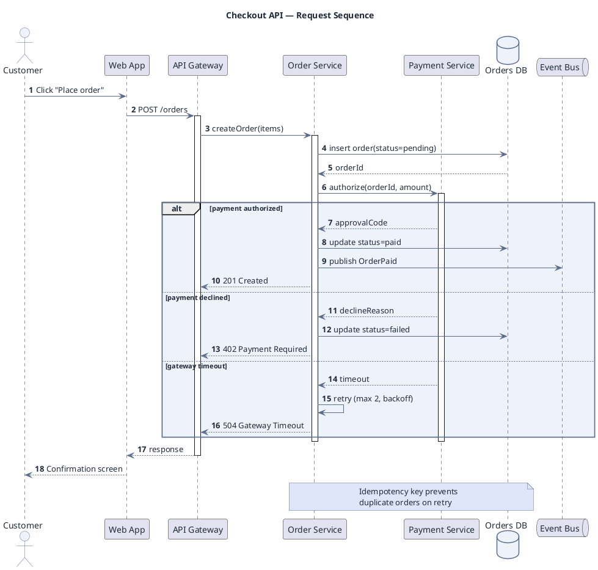

# API Interaction Sequence

**Best for**: showing the exact order of calls between components, including retries and failure branches
**Avoid when**: the reader only needs the static structure (use a class or component diagram)
**Answers**: who calls whom, in what order, and what happens when a step fails

## Key Options

| Syntax | Effect |
|---|---|
| `actor` / `participant` / `database` / `queue` | Lifeline kinds — the icon tells the reader what the box is |
| `autonumber` | Numbers every message; essential once a diagram passes ~8 arrows |
| `->` vs `-->` | Call vs return — keep the convention consistent across the diagram |
| `activate` / `deactivate` | Shows the span during which a component is busy |
| `alt` / `else` / `end` | Failure and branching paths (this is where sequence diagrams earn their keep) |
| `note over A, B` | Cross-cutting remark (idempotency, retries, timeouts) |

## Data Shape

Ordered messages between named lifelines, one path per outcome. Group by **success / business failure /
infrastructure failure** — readers scan for the branch they care about.

## Pitfalls

- ❌ Only drawing the success path → ✅ at least one failure branch; retries and timeouts are the interesting part
- ❌ Using `participant` for everything → ✅ `actor` for humans, `database` for storage, `queue` for async hops
- ❌ Unbounded `alt` nesting → ✅ more than two levels means the flow should be split into two diagrams
- ❌ Forgetting activation bars → ✅ they make concurrency and blocking visible at a glance

## Alternatives

| Variant | Use instead |
|---|---|
| Async, no reply expected | Arrow `->>` and no return edge |
| Multiple participants in parallel | `par` fragments |
| State of one entity over time | A state machine diagram (`order-state-machine.md`) |

<!-- source: PlantUML sequence syntax (draw-uml L1); legacy skills/uml/examples/sequence-diagram.md renders 15/15 -->
