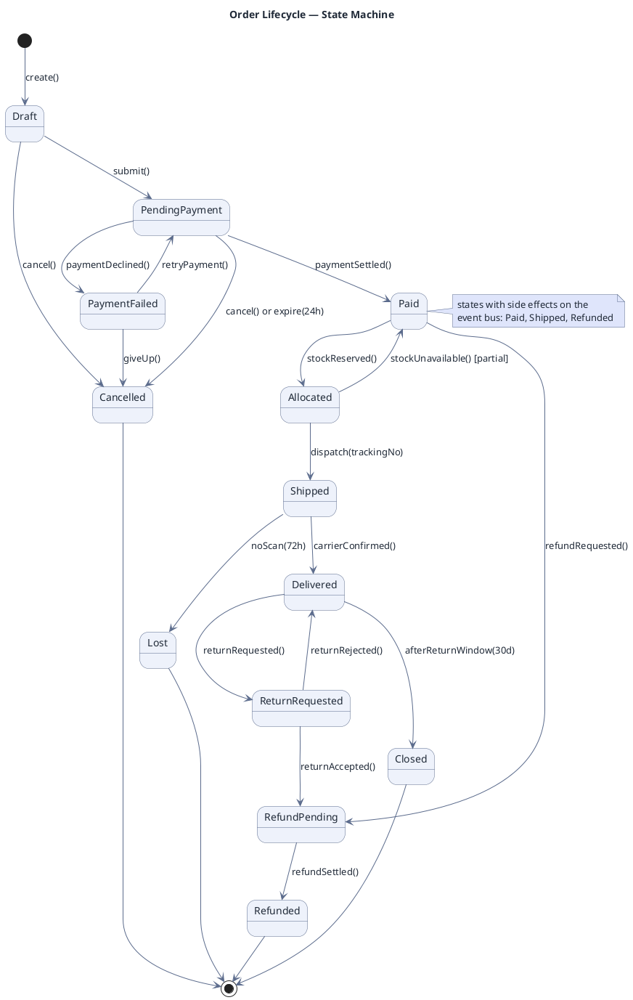

# Entity State Machine

**Best for**: the lifecycle of one entity — allowed states, allowed transitions, and who may trigger them
**Avoid when**: the reader needs the interaction between multiple actors (use a sequence diagram)
**Answers**: which states exist, how an entity moves between them, and which transitions are illegal

## Key Options

| Syntax | Effect |
|---|---|
| `[*] --> First` / `Last --> [*]` | Initial and final states |
| `A --> B : trigger()` | Transition label = the event that causes it; use parentheses for calls |
| `[guard]` | Square-bracket guard conditions (`[partial]`, `[amount > 1000]`) |
| `state X { ... }` | Composite/nested state when a sub-lifecycle exists |
| `note right of X` | Cross-cutting remark (side effects, SLAs) |

## Data Shape

A directed graph of states with labelled transitions. The value is in the **negative space**: transitions that are
*not* drawn are the ones the domain forbids — mention that in the surrounding prose.

## Pitfalls

- ❌ Drawing every possible transition → ✅ model the allowed ones; forbidden transitions are the contract
- ❌ Using state names as transition labels → ✅ labels are **events** (`paymentDeclined()`), states are nouns
- ❌ No final states → ✅ every branch should terminate in `[*]` (or an explicit terminal state like `Lost`)
- ❌ Hiding timers → ✅ time-based transitions (`expire(24h)`, `noScan(72h)`) belong in the label

## Alternatives

| Variant | Use instead |
|---|---|
| Flow of work across roles (not one entity) | `approval-workflow-swimlane.md` |
| Data model of the entity | `domain-class-model.md` |
| Runtime message sequence | `api-interaction-sequence.md` |

<!-- source: draw-uml state parser (L1, 32 fixtures) -->
