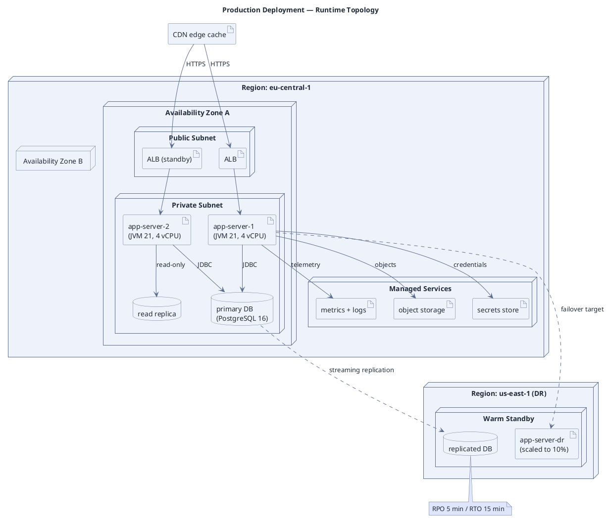

# Runtime Deployment Topology

**Best for**: where the software actually runs — nodes, regions/zones, containers and execution environments
**Avoid when**: the reader needs the logical component structure (use a component diagram)
**Answers**: which artifacts run on which node, and how the nodes relate (region, zone, network)

## Key Options

| Syntax | Effect |
|---|---|
| `node "X" { ... }` | Execution environment; nesting expresses region → zone → subnet |
| `artifact "X"` | Deployable unit (the thing you ship) |
| `database "X"` | Managed storage (do not draw databases as artifacts) |
| `A ..> B` | Replication / failover relationships (logical, not request-path) |
| Nesting depth | Three levels is usually the useful maximum; deeper nesting hides the story |

## Data Shape

A **containment tree** (region → zone → subnet → artifact) plus cross-node edges for the request path and replication.
Reader question: "what runs where, and what happens if a node dies".

## Pitfalls

- ❌ Drawing every environment (dev/stage/prod) in one diagram → ✅ one environment per diagram; environments differ
- ❌ Missing the failure story → ✅ include replicas/standby and label RPO/RTO in a note
- ❌ Using components where nodes belong → ✅ components are logical units; nodes are places that fail
- ❌ Sizing details in every box → ✅ put CPU/memory only where capacity is the question being discussed

## Alternatives

| Variant | Use instead |
|---|---|
| Logical structure and interfaces | `component-decomposition.md` |
| Cloud-provider architecture with service icons | `aws-serverless-architecture.md` |
| Network device/zone topology | `network-topology-enterprise.md` |

<!-- source: draw-uml deployment parser (L1, 59 fixtures) -->
