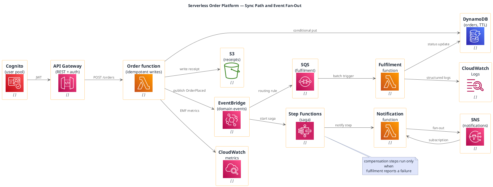

# Serverless Event-Driven Platform (AWS, portable icons)

**Best for**: showing a modern serverless system end to end — synchronous API path plus asynchronous event fan-out
**Avoid when**: the runtime placement matters (use a deployment topology) or the message semantics dominate (use an EIP diagram)
**Answers**: how a request is served, what happens after the response returns, and where state lives

## Key Options

| Syntax | Effect |
|---|---|
| `!include <awslib/GroupIcons/all.puml>` | Group/edge icons **and** `StepFunction`, `VPCSubnet*`, `AutoScalingGroup`, `Cloud` |
| `!include <awslib/general/all.puml>` | Generic icons: `User(s)`, `Server(s)`, `Firewall`, `Internet`, `Gear`, `Document` … |
| `Semaphore(alias, "Label", " ")` | Third argument is the resource/secondary line — a single space keeps it empty |
| `hide stereotype` | Removes the `<<stereotype>>` labels the awslib macros attach |
| `left to right direction` | Request path reads left→right; async consumers sit below |
| Portability | awslib is official PlantUML stdlib — renders in any PlantUML tool |

## Data Shape

Two layers of flow: **synchronous** (identity → gateway → function → state) and **asynchronous**
(bus → queue/saga → consumers → state). State nodes appear once and are written by several functions —
that makes ownership of the data obvious.

## Pitfalls

- ❌ Fan-out drawn as a chain → ✅ a bus with several subscribers; otherwise the diagram implies ordering that does not exist
- ❌ Hiding idempotency → ✅ note or label it on the write edge; retries are guaranteed in this architecture
- ❌ No dead-letter path → ✅ at-least-once delivery needs a DLQ or an explicit drop policy
- ❌ Forgetting the auth hop → ✅ `Cognito → API Gateway` is the security boundary reviewers look for first

## Alternatives

| Variant | Use instead |
|---|---|
| Message semantics (routing, filtering, DLQ patterns) | `eip-message-flow.md` |
| Full AWS service map with vendor-style icons | `aws-serverless-architecture.md` (`mxgraph.aws4` extension) |
| Cost/scale analysis of the same design | An infocard metric grid or a table |

<!-- source: draw-uml-dev fixtures/plantuml/stdlib/aws/002 (ApplicationIntegration) + 006/007 (Compute) + 012 (Database) + 032 (Security) + 025 (ManagementGovernance) macro lists -->
