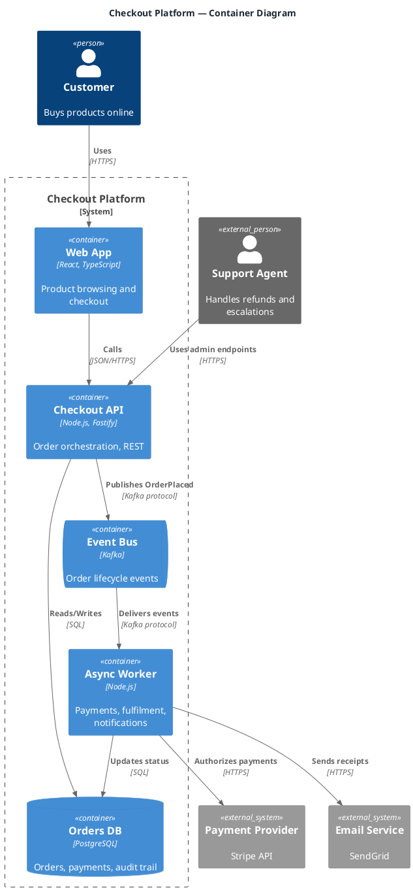

# C4 Container Diagram

**Best for**: communicating a system's shape to mixed audiences without teaching a notation first
**Avoid when**: you need deployment detail (use a deployment diagram) or class-level design
**Answers**: which containers exist, who uses them, and how they talk (with technology labels)

## Key Options

| Syntax | Effect |
|---|---|
| `!include <c4/C4_Container>` | Loads the container-level macros (use `C4_Context` for the higher-level view) |
| `Person` / `Person_Ext` | Internal vs external actor — the suffix is the trust distinction |
| `System_Boundary(alias, "Name") { … }` | Draws the system boundary around your own containers |
| `Container` / `ContainerDb` / `ContainerQueue` | Container shapes by kind: service, datastore, message queue |
| `System_Ext(...)` | External system outside your boundary |
| `Rel(from, to, "description", "technology")` | The 4th argument (technology) is the reason to use C4 — always fill it |
| `title` | Diagram title in C4 style ("Container Diagram — …") |

## Data Shape

Actors outside, one `System_Boundary` around your containers, external systems at the edge, and `Rel()` edges
carrying both intent and technology. Reader question: "what are the moving parts and what are they built with".

## Pitfalls

- ❌ Skipping the technology argument → ✅ `Rel(..., "HTTPS")` / `"SQL"` is C4's main value; without it the diagram is a bubble chart
- ❌ Using components inside a container diagram → ✅ containers only; components belong to the next C4 level
- ❌ No boundary → ✅ external systems must sit outside `System_Boundary`, otherwise ownership is ambiguous
- ❌ Bypassing containers (person → database) → ✅ model the real path; shortcuts hide the missing component

## Alternatives

| Variant | Use instead |
|---|---|
| High-level view for non-technical stakeholders | The same file with `!include <c4/C4_Context>` and `System()` instead of `Container()` |
| Deployment/runtime placement | `runtime-deployment-topology.md` |
| Message-level detail | `api-interaction-sequence.md` or `eip-message-flow.md` |

<!-- source: draw-uml-dev fixtures/plantuml/stdlib/c4/001/002.puml (C4_Context / C4_Container macros) -->
