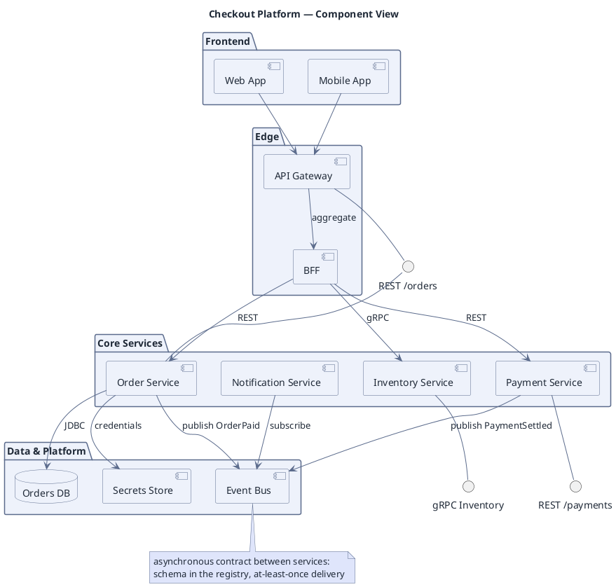

# Component Decomposition

**Best for**: showing which services/components exist and their provided/required interfaces
**Avoid when**: the reader wants the class-level detail inside a component (use a class diagram)
**Answers**: what the system is made of, and which interfaces connect the parts

## Key Options

| Syntax | Effect |
|---|---|
| `component [Name] as alias` | Component box (the classic UML component shape) |
| `interface "Name" as i` + `--` / `-up-` | Provided/required interface with a ball-and-socket edge |
| `package "Layer" { ... }` | Deployment-independent grouping (frontend / edge / services / platform) |
| `database "X"` | Storage is not a component — give it the database shape |
| Direction | `left to right direction` helps wide component diagrams; default TB works for layered ones |

## Data Shape

Components grouped by **responsibility layer**, connected either directly (call) or through an explicit interface.
Async channels (event bus) should be a component of their own, with publisher/subscriber edges.

## Pitfalls

- ❌ Every arrow pointing straight at a service, no interfaces → ✅ declare the interface when the contract matters
- ❌ Hiding the message broker → ✅ the bus is the contract between services; draw it and label publish/subscribe
- ❌ Mixing components with deployment nodes (`node`, `cloud`) → ✅ components are logical; use a deployment diagram for physical placement
- ❌ Layers with no meaning → ✅ name layers by responsibility, not by team org chart

## Alternatives

| Variant | Use instead |
|---|---|
| Physical deployment (nodes, regions, containers) | `runtime-deployment-topology.md` |
| Class-level detail of one service | `domain-class-model.md` |
| Message-level integration patterns | `eip-message-flow.md` |

<!-- source: draw-uml component parser (L1, 32 fixtures) -->
