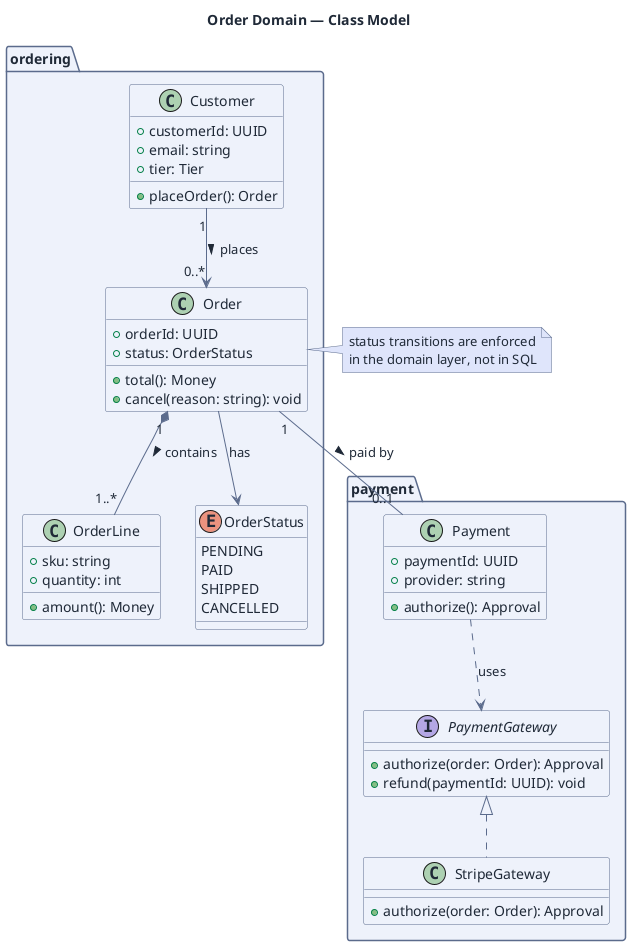

# Domain Class Model

**Best for**: describing entities, their attributes/operations and the relationships between them
**Avoid when**: the reader needs runtime behaviour (use a sequence diagram) or deployment layout
**Answers**: what the domain concepts are and how they relate (inheritance, composition, association)

## Key Options

| Syntax | Effect |
|---|---|
| `class X { +field: type  +method(): type }` | Visibility prefixes: `+` public, `-` private, `#` protected |
| `interface` / `enum` / `abstract class` | Declares the kind of type — the icon differs, which carries meaning |
| `<|--` / `<|..` | Inheritance / interface realisation |
| `*--` / `o--` | Composition / aggregation (filled vs hollow diamond) |
| `-->` / `..>` | Association / dependency |
| `"1" --> "0..*"` | Multiplicities on both ends — always add them; unlabelled arrows hide the cardinality decision |
| `package "x" { ... }` | Module boundary |

## Data Shape

Types + relationships. Keep attributes to the ones that carry domain meaning; a class model is not a schema dump.

## Pitfalls

- ❌ Listing every column of every table → ✅ model behaviour (operations) and the invariants that matter
- ❌ Omitting multiplicities → ✅ `"1" --> "0..*"` prevents a dozen follow-up questions
- ❌ Using composition (`*--`) for weak references → ✅ composition means "dies with the owner"
- ❌ Mixing package structure with runtime layering → ✅ packages are modules; deployment is a different diagram

## Alternatives

| Variant | Use instead |
|---|---|
| Runtime object snapshot | An object diagram (`object "x" as id` syntax) |
| Module dependency direction only | A dependency graph in `dot` (see `dependencies-and-relations`) |
| Data model for a database | Entity boxes + crow's foot via the IE syntax (`Entity01 }|..|| Entity02`) |

<!-- source: draw-uml class parser (L1, 82 fixtures); syntax subset per draw-uml README -->
