# Object Snapshot — One Moment in the Model (PlantUML)

**Best for**: explaining a data shape with real values — the case that confused support, or the state after a partial failure
**Avoid when**: you need the schema (use a class or ER diagram) or the flow that produced the state
**Answers**: what the objects actually contain at one point in time

```plantuml
@startuml
skinparam DefaultFontColor #1f2937
skinparam ArrowColor #5b6b8c
skinparam ArrowFontColor #1f2937
skinparam RectangleBackgroundColor #eef2fb
skinparam RectangleBorderColor #5b6b8c
skinparam RectangleFontColor #1f2937
skinparam ComponentBackgroundColor #eef2fb
skinparam ComponentBorderColor #5b6b8c
skinparam ComponentFontColor #1f2937
skinparam ClassBackgroundColor #eef2fb
skinparam ClassBorderColor #5b6b8c
skinparam ClassFontColor #1f2937
skinparam UsecaseBackgroundColor #eef2fb
skinparam UsecaseBorderColor #5b6b8c
skinparam UsecaseFontColor #1f2937
skinparam DatabaseBackgroundColor #eef2fb
skinparam DatabaseBorderColor #5b6b8c
skinparam DatabaseFontColor #1f2937
skinparam NodeBackgroundColor #eef2fb
skinparam NodeBorderColor #5b6b8c
skinparam NodeFontColor #1f2937
skinparam ActorBackgroundColor #eef2fb
skinparam ActorBorderColor #5b6b8c
skinparam ActorFontColor #1f2937
skinparam StateBackgroundColor #eef2fb
skinparam StateBorderColor #5b6b8c
skinparam StateFontColor #1f2937
skinparam ArtifactBackgroundColor #eef2fb
skinparam ArtifactBorderColor #5b6b8c
skinparam ArtifactFontColor #1f2937
skinparam CloudBackgroundColor #eef2fb
skinparam CloudBorderColor #5b6b8c
skinparam CloudFontColor #1f2937
skinparam FolderBackgroundColor #eef2fb
skinparam FolderBorderColor #5b6b8c
skinparam FolderFontColor #1f2937
skinparam PackageBackgroundColor #eef2fb
skinparam PackageBorderColor #5b6b8c
skinparam NoteBackgroundColor #dfe5fb
skinparam NoteBorderColor #5b6b8c
skinparam NoteFontColor #1f2937
skinparam stereotypeABackgroundColor #d9e3f4
skinparam stereotypeABorderColor #5b6b8c
skinparam stereotypeCBackgroundColor #d9e3f4
skinparam stereotypeCBorderColor #5b6b8c
skinparam stereotypeEBackgroundColor #d9e3f4
skinparam stereotypeEBorderColor #5b6b8c
skinparam stereotypeIBackgroundColor #d9e3f4
skinparam stereotypeIBorderColor #5b6b8c
object "order : Order" as order {
  id = "ord_8812"
  status = "AWAITING_PAYMENT"
  total = 128.40
  currency = "EUR"
  created = 2026-09-14T09:12Z
}

object "line : OrderLine" as line1 {
  sku = "SKU-4410"
  qty = 2
}

object "line2 : OrderLine" as line2 {
  sku = "SKU-1092"
  qty = 1
}

object "payment : Payment" as pay {
  id = "pay_3320"
  status = "FAILED"
  reason = "insufficient_funds"
}

order *-- line1
order *-- line2
order --> pay : attempts
@enduml
```

## Data Shape

One block per instance, with `attribute = value` lines. Links are drawn between instances exactly as they
would be between classes — composition (`*--`) for owned parts, association (`-->`) for references.

## Key Options

| Option | Effect |
|---|---|
| `object "name : Class"` | Instance name plus its type — the type is what ties the snapshot to the model |
| `*--` composition | The parts belong to the whole (deleting the order removes the lines) |
| `map` blocks | Same notation for key/value collections when there is no class behind them |
| Field values with units | `total = 128.40` plus a `currency` field; a bare number invites misreading |

## Pitfalls

- ❌ Presenting a snapshot as the schema → ✅ a snapshot has values, a class diagram has types; label it as an example
- ❌ Including every field of the real object → ✅ show only the fields the explanation needs
- ❌ Reusing one object diagram for a flow → ✅ state changes belong in a state machine or sequence diagram
- ❌ No timestamps on time-sensitive data → ✅ one line (`created = …`) removes most "is this stale?" questions

## Alternatives

| Variant | Use instead |
|---|---|
| Types, multiplicities and inheritance | `domain-class-model.md` |
| The calls that produced this state | `api-interaction-sequence.md` |
| Lifecycle of one entity | `order-state-machine.md` |

<!-- source: PlantUML object diagram reference + draw-uml fixture corpus (object-diagram, 14 cases) -->
