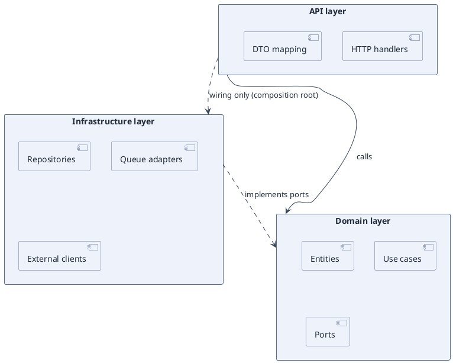

# Package Layering — Enforcing the Dependency Direction (PlantUML)

**Best for**: showing the intended layering of a codebase and which layers may depend on which
**Avoid when**: the reader needs the actual current dependencies (use `dot` on the real import graph)
**Answers**: what the layering is supposed to be, and where an illegal dependency would show up

## Data Shape

One `package` per layer, each holding its components as `[Name]`. Dependency arrows carry the rule being
asserted — this diagram is a *contract*, not a map of reality.

## Key Options

| Option | Effect |
|---|---|
| `skinparam packageStyle rectangle` | Turns folders into plain rectangles; easier to read as layers |
| Solid vs dashed arrows | Solid = compile-time call, dashed = implements / runtime wiring |
| Arrow labels | Name the relationship ("calls", "implements ports") — unlabelled arrows are guesses |
| `!pragma layout elk` | Keeps layers stacked when arrows cross |
| One package per layer | A package holding two layers destroys the reading |

## Pitfalls

- ❌ Drawing the current state and calling it the design → ✅ say whether this is the rule or the reality
- ❌ A "shared utilities" package everyone may depend on → ✅ name the allowed direction from it, or split it
- ❌ Layers implying a runtime call order → ✅ layering is a compile-time rule; runtime flow is a sequence diagram
- ❌ Ten components per package → ✅ the diagram argues about *layers*; keep the contents to what matters

## Alternatives

| Variant | Use instead |
|---|---|
| The real dependency graph with cycles | `dependency-graph.md` (`dot`) |
| Components and their interfaces | `component-decomposition.md` |
| Runtime deployment units | `runtime-deployment-topology.md` |

<!-- source: PlantUML package diagram reference + draw-uml fixture corpus (class-diagram packages, 82 cases) -->
