# Use Case Model — Who Can Do What (PlantUML)

**Best for**: agreeing on scope — which actors get which capabilities, and what the system includes
**Avoid when**: the reader needs the order of steps (use a sequence or activity diagram) or the structure of the code
**Answers**: what the system offers each kind of user, and which capabilities are optional

```plantuml
@startuml
skinparam DefaultFontColor #1f2937
skinparam ArrowColor #5b6b8c
skinparam ArrowFontColor #1f2937
skinparam RectangleBackgroundColor #eef2fb
skinparam RectangleBorderColor #5b6b8c
skinparam RectangleFontColor #1f2937
skinparam ComponentBackgroundColor #eef2fb
skinparam ComponentBorderColor #5b6b8c
skinparam ComponentFontColor #1f2937
skinparam ClassBackgroundColor #eef2fb
skinparam ClassBorderColor #5b6b8c
skinparam ClassFontColor #1f2937
skinparam UsecaseBackgroundColor #eef2fb
skinparam UsecaseBorderColor #5b6b8c
skinparam UsecaseFontColor #1f2937
skinparam DatabaseBackgroundColor #eef2fb
skinparam DatabaseBorderColor #5b6b8c
skinparam DatabaseFontColor #1f2937
skinparam NodeBackgroundColor #eef2fb
skinparam NodeBorderColor #5b6b8c
skinparam NodeFontColor #1f2937
skinparam ActorBackgroundColor #eef2fb
skinparam ActorBorderColor #5b6b8c
skinparam ActorFontColor #1f2937
skinparam StateBackgroundColor #eef2fb
skinparam StateBorderColor #5b6b8c
skinparam StateFontColor #1f2937
skinparam ArtifactBackgroundColor #eef2fb
skinparam ArtifactBorderColor #5b6b8c
skinparam ArtifactFontColor #1f2937
skinparam CloudBackgroundColor #eef2fb
skinparam CloudBorderColor #5b6b8c
skinparam CloudFontColor #1f2937
skinparam FolderBackgroundColor #eef2fb
skinparam FolderBorderColor #5b6b8c
skinparam FolderFontColor #1f2937
skinparam PackageBackgroundColor #eef2fb
skinparam PackageBorderColor #5b6b8c
skinparam NoteBackgroundColor #dfe5fb
skinparam NoteBorderColor #5b6b8c
skinparam NoteFontColor #1f2937
skinparam stereotypeABackgroundColor #d9e3f4
skinparam stereotypeABorderColor #5b6b8c
skinparam stereotypeCBackgroundColor #d9e3f4
skinparam stereotypeCBorderColor #5b6b8c
skinparam stereotypeEBackgroundColor #d9e3f4
skinparam stereotypeEBorderColor #5b6b8c
skinparam stereotypeIBackgroundColor #d9e3f4
skinparam stereotypeIBorderColor #5b6b8c
left to right direction

actor "Customer" as customer
actor "Support agent" as agent
actor "Payment provider" as psp

rectangle "Checkout service" {
  usecase "Browse catalog" as browse
  usecase "Place order" as order
  usecase "Pay by card" as pay
  usecase "Refund order" as refund
  usecase "Handle dispute" as dispute
}

customer --> browse
customer --> order
order ..> pay : <<include>>
pay --> psp
agent --> refund
agent --> dispute
dispute ..> refund : <<extend>>
@enduml
```

## Data Shape

Actors, a system boundary rectangle, and relationships. Two dashed relationship kinds carry the semantics:

| Relationship | Meaning |
|---|---|
| `..> : <<include>>` | Always happens as part of the base case (order → pay) |
| `..> : <<extend>>` | Optional or exceptional path that extends the base case (dispute → refund) |
| `--` | Actor association — the actor can trigger the use case |
| `--\|>` | Actor or use-case generalisation |

## Key Options

| Option | Effect |
|---|---|
| `left to right direction` | Horizontal layout; almost always better for use-case diagrams |
| `rectangle "Name" { … }` | The system boundary — everything inside is in scope |
| `usecase "X" as alias` | Named alias keeps the relationships readable |
| `!pragma layout elk` | Switch the layout engine when edges cross badly |
| Stereotypes on actors (`<<system>>`) | Marks external systems separately from human roles |

## Pitfalls

- ❌ Drawing a flow as use cases ("Validate card" → "Charge card") → ✅ use cases are *goals*, not steps; that is an activity diagram
- ❌ Mixing include and extend in the same direction → ✅ include = mandatory part, extend = optional addition; the arrow always points at the base case
- ❌ No system boundary → ✅ without the rectangle the reader cannot tell what is inside the product
- ❌ Actors for internal components → ✅ actors are outside the system; internal parts belong in a component diagram

## Alternatives

| Variant | Use instead |
|---|---|
| Ordered interaction with a system | `api-interaction-sequence.md` |
| Internal structure of the service | `component-decomposition.md` |
| Business process with roles and decisions | `basic-activity-flow.md` |

<!-- source: PlantUML use-case diagram reference + draw-uml fixture corpus (use-case-diagram, 25 cases) -->
