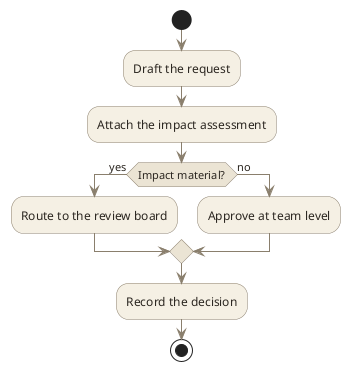

# Policy Approval Flow (PlantUML)

**Best for**: a policy or memo figure that will be read as prose is read — on cream stock, at length
**Avoid when**: the figure must survive a photocopier above all else — the warm hues flatten in mono
**Answers**: who approves what, and where a request can be sent back

## Data Shape

One step per action, one decision node per branch. A policy flow should fit on one page — if it does
not, it is two flows.

## Key Options

| Option | Effect |
|---|---|
| The activity block | Themes every action and the decision diamond in one go |
| `:step; <<#fill>>` | Colours a single step, when one branch deserves emphasis |
| One block per diagram family | Sequence and structure diagrams take their own keys; do not mix blocks |

## Pitfalls

- ❌ Building a key with PlantUML's `legend` block → ✅ legend and title colours are not themeable in this engine; put the key in the surrounding prose
- ❌ Expecting a package's label colour to change → ✅ `PackageFontColor` is a no-op; the fill and border do change
- ❌ Mixing this block with the structure block → ✅ one block per diagram, or the two fight over the same keys

## Alternatives

| Variant | Use instead |
|---|---|
| A memo page with the flow beside it | `executive-brief-summary.md` |
| A mono-safe version for printing | `print-handout-graph.md` |
| A state machine rather than a flow | `order-state-machine.md` |

<!-- source: theme showcase — Editorial theme, plantuml activity block -->
