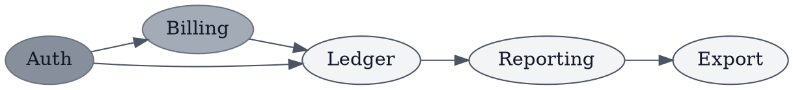

# Photocopy-Safe Dependency Graph (DOT)

**Best for**: a handout that will be printed, photocopied, or read on a fax-grade screen
**Avoid when**: the figure needs eight distinguishable categories — a mono ladder has five usable steps
**Answers**: what depends on what, in a figure that survives losing its colour

## Data Shape

One node per service or module, one edge per dependency. Keep the graph at the level where an edge
means something a reader would defend in a review.

## Key Options

| Option | Effect |
|---|---|
| The three attribute lines | Every node and edge gets the theme, including the ones not named |
| `fillcolor` + `color` on one node | Highlights that node's family without restating the whole block |
| `rankdir=LR` | Turns a deep chain into a wide one — better for a page's aspect ratio |

## Pitfalls

- ❌ Relying on colour to carry a category → ✅ in a mono theme, label it or vary the shape; red and green print identically
- ❌ Setting `fillcolor` without `style=filled` → ✅ Graphviz ignores the fill and draws an empty outline
- ❌ Adding a second accent "for emphasis" → ✅ the mono ladder *is* the emphasis scale; a stray colour defeats the point

## Alternatives

| Variant | Use instead |
|---|---|
| A coloured version for screen | `module-import-arcs.md` |
| A layered architecture view | `package-layering.md` |
| A long-form policy diagram | `editorial-policy-flow.md` |

<!-- source: theme showcase — Print theme, dot attribute block -->
